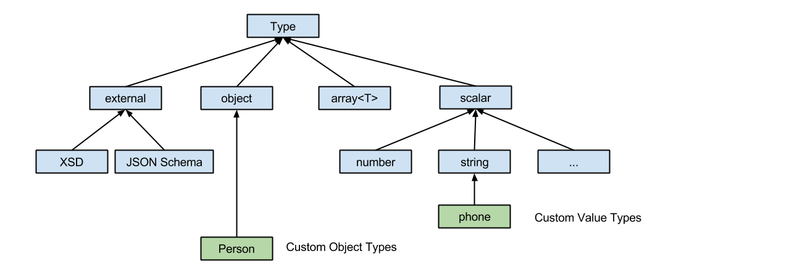

# RAML Version 1.0: RESTful API Modeling Language

## Abstract

RAML is a language for the definition of HTTP-based APIs that embody most or all of the principles of Representational State Transfer (REST). This document constitutes the RAML specification, an application of the [YAML 1.2 specification](http://yaml.org/spec/1.2/spec.html). The RAML specification provides mechanisms for defining practically-RESTful APIs, creating client/server source code, and comprehensively documenting the APIs for users.

## Status of this Document

This document constitutes the RAML 1.0 specification. The consensus of specification authors and RAML 0.8 users determines the contents of this document. We strongly recommend that implementers and users of the RAML 0.8 specification update their software and API definitions to the RAML 1.0 specification.

## Terminology and Conformance Language

Normative text describes one or both of the following kinds of elements:

* Vital elements of the specification
* Elements that contain the conformance language key words as defined by [IETF RFC 2119](https://www.ietf.org/rfc/rfc2119.txt) "Key words for use in RFCs to Indicate Requirement Levels"

Informative text is potentially helpful to the user, but dispensable. Informative text can be changed, added, or deleted editorially without negatively affecting the implementation of the specification. Informative text does not contain conformance keywords.

All text in this document is, by default, normative.

The key words "MUST", "MUST NOT", "REQUIRED", "SHALL", "SHALL NOT", "SHOULD", "SHOULD NOT", "RECOMMENDED", "MAY", and "OPTIONAL" in this document are to be interpreted as described in [IETF RFC 2119](https://www.ietf.org/rfc/rfc2119.txt) "Key words for use in RFCs to Indicate Requirement Levels".

## Definitions and Terminology

### General

In this specification, **API definition** means an API using this specification.

**RAML Specification** refers to this document.

**REST** is used in the context of an API implemented using some or all of the principles of REST (Representational State Transfer), which was introduced and first defined in 2000 in Chapter 5, [REST](http://www.ics.uci.edu/~fielding/pubs/dissertation/rest_arch_style.htm), of the doctoral dissertation *"Architectural Styles and the Design of Network-based Software Architecture"* by Roy Fielding.

A **resource** is the conceptual mapping to an entity or set of entities.

A trailing question mark in key names MAY denote an optional key.

### Template URI

A template URI refers to a URI parameter, which is a variable element, enclosed in curly brackets (`{}`) inside a relative URI of a resource.

RAML fully supports Level 2 as defined in [RFC6570](https://tools.ietf.org/html/rfc6570) for URI Templates.

### Markdown

Throughout this specification, **Markdown** means [GitHub-Flavored Markdown](https://github.github.com/gfm/).

## Table of Content

<!-- TOC -->

- [Introduction](#introduction)
- [What's New and Different in RAML 1.0](#whats-new-and-different-in-raml-10)
- [Markup Language](#markup-language)
- [The Root of the Document](#the-root-of-the-document)
	- [User Documentation](#user-documentation)
	- [Base URI and Base URI Parameters](#base-uri-and-base-uri-parameters)
	- [Protocols](#protocols)
	- [Default Media Types](#default-media-types)
	- [Default Security](#default-security)
- [RAML Data Types](#raml-data-types)
	- [Introduction](#introduction-1)
	- [Overview](#overview)
	- [Defining Types](#defining-types)
	- [Type Declarations](#type-declarations)
	- [Built-in Types](#built-in-types)
		- [The "Any" Type](#the-any-type)
		- [Object Type](#object-type)
			- [Property Declarations](#property-declarations)
			- [Additional Properties](#additional-properties)
			- [Object Type Specialization](#object-type-specialization)
			- [Using Discriminator](#using-discriminator)
		- [Array Type](#array-type)
		- [Scalar Types](#scalar-types)
			- [String](#string)
			- [Number](#number)
			- [Integer](#integer)
			- [Boolean](#boolean)
			- [Date](#date)
			- [File](#file)
			- [Nil Type](#nil-type)
		- [Union Type](#union-type)
		- [Using XML and JSON Schemas](#using-xml-and-json-schemas)
	- [User-defined Facets](#user-defined-facets)
	- [Determine Default Types](#determine-default-types)
	- [Type Expressions](#type-expressions)
	- [Multiple Inheritance](#multiple-inheritance)
	- [Inline Type Declarations](#inline-type-declarations)
	- [Defining Examples in RAML](#defining-examples-in-raml)
		- [Multiple Examples](#multiple-examples)
		- [Single Example](#single-example)
		- [Example of how to define example/examples in RAML](#example-of-how-to-define-exampleexamples-in-raml)
	- [XML Serialization of Type Instances](#xml-serialization-of-type-instances)
	- [Using Types in RAML](#using-types-in-raml)
- [Resources and Nested Resources](#resources-and-nested-resources)
	- [Resource Property](#resource-property)
	- [Template URIs and URI Parameters](#template-uris-and-uri-parameters)
- [Methods](#methods)
	- [Headers](#headers)
	- [Query Strings and Query Parameters](#query-strings-and-query-parameters)
		- [The Query String as a Whole](#the-query-string-as-a-whole)
		- [Query Parameters in a Query String](#query-parameters-in-a-query-string)
	- [Bodies](#bodies)
- [Responses](#responses)
- [Resource Types and Traits](#resource-types-and-traits)
	- [Declaring Resource Types and Traits](#declaring-resource-types-and-traits)
	- [Applying Resource Types and Traits](#applying-resource-types-and-traits)
	- [Resource Type and Trait Parameters](#resource-type-and-trait-parameters)
	- [Declaring HTTP Methods as Optional](#declaring-http-methods-as-optional)
	- [Algorithm of Merging Traits and Methods](#algorithm-of-merging-traits-and-methods)
	- [Resource Types and Traits Effect on Collections](#resource-types-and-traits-effect-on-collections)
- [Security Schemes](#security-schemes)
	- [Security Scheme Types](#security-scheme-types)
	- [Security Scheme Declaration](#security-scheme-declaration)
		- [describedBy](#describedby)
		- [Settings](#settings)
			- [OAuth 1.0](#oauth-10)
			- [OAuth 2.0](#oauth-20)
			- [Basic Authentication](#basic-authentication)
			- [Digest Authentication](#digest-authentication)
			- [Pass Through](#pass-through)
			- [x-&lt;other&gt;](#x-other)
		- [Applying Security Schemes](#applying-security-schemes)
- [Annotations](#annotations)
	- [Declaring Annotation Types](#declaring-annotation-types)
	- [Applying Annotations](#applying-annotations)
		- [Annotating Scalar-valued Nodes](#annotating-scalar-valued-nodes)
		- [Annotation Targets](#annotation-targets)
- [Modularization](#modularization)
	- [Includes](#includes)
		- [Typed Fragments](#typed-fragments)
		- [Resolving Includes](#resolving-includes)
	- [Libraries](#libraries)
	- [Overlays and Extensions](#overlays-and-extensions)
		- [Overlays](#overlays)
		- [Extensions](#extensions)
		- [Merging Rules](#merging-rules)
- [References](#references)

<!-- /TOC -->

## Introduction

This specification describes the RESTful API Modeling Language (RAML). RAML is a human- and machine-readable language for the definition of a RESTful application programming interface (API). RAML is designed to improve the specification of the API by providing a format that the API provider and API consumers can use as a mutual contract. RAML can, for example, facilitate providing user documentation and source code stubs for client and server implementations. Such provisions streamline and enhance the definition and development of interoperable applications that utilize RESTful APIs.

RAML introduces the innovative concept of resource types and traits for characterizing and reusing patterns of resources and associated methods. Using resource types and traits minimizes the repetition in a RESTful API design and promotes consistency within and across APIs.

This document is organized as follows:

* **Basic Information**. How to describe core aspects of the API, such as its name, title, location (or URI), and defaults and how to include supporting documentation for the API.
* **Data Types**. Modeling API data through a streamlined type system that encompasses JSON Schema and XML Schema (XSD).
* **Resources**. How to specify API resources and nested resources, as well as URI parameters in any URI templates.
* **Methods**. How to specify the methods on API resources and their request headers, query parameters, and request bodies.
* **Responses**. The specification of API responses, including status codes, media types, response headers, and response bodies.
* **Resource Types and Traits**. The optional use of RAML resource types and traits to characterize resources.
* **Security**. Specifying an API security scheme in RAML.
* **Annotations**. Extending a RAML specification by defining strongly-typed annotations and applying them throughout the specification.
* **Includes, Libraries, Overlays, and Extensions**. How an API definition can consist of externalized definition documents, packaging collections of such definitions into libraries, separating and overlaying layers of metadata on a RAML document, and extending an API specification with additional functionality.

## What's New and Different in RAML 1.0

* **Data types**: a unified, streamlined, and powerful way to model data wherever it appears in an API.
  * Uniformly covers bodies, URI parameters, headers, and query parameters and eliminates the need for a separate formParameters construct
  * Supports wrapping XML and JSON schemas, and referring to sub-schemas, but in many cases, obviates the schemas
  * Simplifies coding, compared to JSON Schema or XML Schema (XSD), because it is YAML-based
* **Examples**: multiple examples, expressible in YAML, and annotatable, so semantics can be injected
* **Annotations**: a tried-and-tested, strongly-typed mechanism for extensibility
* **Libraries**: improved modularity for broad reuse of API artifacts
* **Overlays** and **Extensions**: increased extensibility through separated files
* **Improved Security Schemes**:
  * Wider OAuth support
  * Support for pass-through (key-based) security schemes
* **Several smaller changes** for consistency and expressivity

## Markup Language

This specification uses [YAML 1.2](http://www.yaml.org/spec/1.2/spec.html) as its underlying format. YAML is a human-readable data format that aligns well with the design goals of this specification. As in YAML, all nodes such as keys, values, and tags, are case-sensitive.

RAML API definitions MUST be YAML 1.2-compliant documents that begin with a REQUIRED YAML-comment line that indicates the RAML version, as follows:

```yaml
#%RAML 1.0
title: My API
```

The first line of a RAML API definition document MUST begin with the text _#%RAML_ followed by a single space followed by the text _1.0_ and nothing else before the end of the line. RAML fragment documents begin similarly with the RAML version comment and a [fragment identifier](#typed-fragments), but are not in themselves RAML API definition documents.

The media type _application/raml+yaml_ and its associated file extension _.raml_ SHALL be used to designate files containing RAML API definitions, RAML fragments, and files that contain RAML markup. RAML is also capable of including documents of other media types, such as “application/schema+json” and “application/yaml”.

To facilitate the automated processing of RAML documents, RAML imposes the following restrictions and requirements in addition to the core YAML 1.2 specification:

* The first line of a RAML file MUST consist of a YAML comment that specifies the RAML version. Therefore, RAML processors SHALL NOT completely ignore all YAML comments.
* The order of some properties at certain levels within a RAML document is significant. Therefore, processors SHALL preserve this ordering.

## The Root of the Document

The root section of the RAML document describes the basic information about an API, such as its title and version. The root section also defines assets used elsewhere in the RAML document, such as types and traits.

Nodes in a RAML-documented API definition MAY appear in any order. Processors MUST preserve the order of nodes of the same kind within the same node of the definition tree. Examples of such nodes are resources that appear at the same level of the resource tree, methods for a given resource, parameters for a given method, and nodes at the same level in a given type. Processors MUST also preserve the order of items within arrays.

This example shows a small part of a RAML API definition for the GitHub v3 public API.

```yaml
#%RAML 1.0
title: GitHub API
version: v3
baseUri: https://api.github.com
mediaType:  application/json
securitySchemes:
  oauth_2_0: !include securitySchemes/oauth_2_0.raml
types:
  Gist:  !include types/gist.raml
  Gists: !include types/gists.raml
resourceTypes:
  collection: !include types/collection.raml
traits:
securedBy: [ oauth_2_0 ]
/users:
  type: collection
  get:
```

The following table enumerates the possible nodes at the root of a RAML document:

| Name  | Description |
|:----------|:----------|
| title | A short, plain-text label for the API. Its value is a string.
| description? | A substantial, human-friendly description of the API. Its value is a string and MAY be formatted using [markdown](#markdown).
| version? | The version of the API, for example "v1". Its value is a string.
| baseUri? | A URI that serves as the [base for URIs](#base-uri-and-base-uri-parameters) of all resources. Often used as the base of the URL of each resource containing the location of the API. Can be a [template URI](#template-uri).
| baseUriParameters? | Named parameters used in the [baseUri](#base-uri-and-base-uri-parameters) (template).
| protocols? | The [protocols](#protocols) supported by the API.
| mediaType? | The [default media types](#default-media-types) to use for request and response bodies (payloads), for example "application/json".
| documentation? | Additional overall [documentation](#user-documentation) for the API.
| schemas? | An alias for the equivalent "types" node for compatibility with RAML 0.8. Deprecated - API definitions SHOULD use the "types" node because a future RAML version might remove the "schemas" alias with that node. The "types" node supports XML and JSON schemas.
| types? | Declarations of [(data) types](#defining-types) for use within the API.
| traits? | Declarations of [traits](#resource-types-and-traits) for use within the API.
| resourceTypes? | Declarations of [resource types](#resource-types-and-traits) for use within the API.
| annotationTypes? | Declarations of [annotation types](#declaring-annotation-types) for use by annotations.
| (&lt;annotationName&gt;)? | [Annotations](#annotations) to be applied to this API. An annotation is a map having a key that begins with "(" and ends with ")" where the text enclosed in parentheses is the annotation name, and the value is an instance of that annotation.
| securitySchemes? | Declarations of [security schemes](#security-schemes) for use within the API.
| securedBy? | The [security schemes](#applying-security-schemes) that apply to every resource and method in the API.
| uses? | Imported external [libraries](#libraries) for use within the API.
| /&lt;relativeUri&gt;? | The resources of the API, identified as relative URIs that begin with a slash (/). A [resource node](#resources-and-nested-resources) is one that begins with the slash and is either at the root of the API definition or a child of a resource node. For example, `/users` and `/{groupId}`.

The "schemas" and "types" nodes are mutually exclusive and synonymous: processors MUST NOT allow both to be specified at the root-level of an API definition. We recommended using the "types" node instead of "schemas" because the schemas alias is deprecated and might be removed in a future RAML version.

### User Documentation

The OPTIONAL **documentation** node includes a variety of documents that serve as user guides and reference documentation for the API. Such documents can clarify how the API works or provide technical and business context.

The value of the documentation node MUST be a sequence of one or more documents. Each document is a map that MUST have exactly two key-value pairs described in the following table:

| Name  | Description |
|:----------|:----------|
| title | Title of the document. Its value MUST be a non-empty string.
| content | Content of the document. Its value MUST be a non-empty string and MAY be formatted using [markdown](#markdown).

This example shows an API definition having two user documents.

```yaml
#%RAML 1.0
title: ZEncoder API
baseUri: https://app.zencoder.com/api
documentation:
 - title: Home
   content: |
     Welcome to the _Zencoder API_ Documentation. The _Zencoder API_
     allows you to connect your application to our encoding service
     and encode videos without going through the web  interface. You
     may also benefit from one of our
     [integration libraries](https://app.zencoder.com/docs/faq/basics/libraries)
     for different languages.
 - title: Legal
   content: !include docs/legal.markdown
```

### Base URI and Base URI Parameters

The OPTIONAL **baseUri** node specifies a URI as an identifier for the API as a whole, and MAY be used to specify the URL at which the API is served (its service endpoint), and which forms the base of the URLs of each of its resources. The value of the baseUri node is a string that MUST conform to the URI specification [RFC2396](https://www.ietf.org/rfc/rfc2396.txt) or a [Template URI](#template-uri).

If the baseUri value is a [Template URI](#template-uri), the following reserved base URI parameter is available.

| URI Parameter | Value |
|:----------|:----------|
| version | The value of the root-level version node

Any other URI template variables appearing in the baseUri MAY be described explicitly within a **baseUriParameters** node at the root of the API definition. The baseUriParameters node has the same semantics and therefore MUST follow the same structure as the [uriParameters](#template-uris-and-uri-parameters) node on a resource node, except that it specifies parameters in the base URI rather than the relative URI of a resource.

The following example RAML API definition uses a [Template URI](#template-uri) as the base URI.

```yaml
#%RAML 1.0
title: Salesforce Chatter REST API
version: v28.0
baseUri: https://na1.salesforce.com/services/data/{version}/chatter
```

The following example declares an explicit base URI parameter.

```yaml
#%RAML 1.0
title: Amazon S3 REST API
version: 1
baseUri: https://{bucketName}.s3.amazonaws.com
baseUriParameters:
  bucketName:
    description: The name of the bucket
```

When the base URI ends in one or more slashes (`/`), the trailing slashes are omitted in the absolute paths for the resources using that base URI. For example, in the following snippet, the absolute paths for the resources are `http://api.test.com/common/users/:userId` and `http://api.test.com/common/users/:userId/groups`.

```yaml
baseUri: http://api.test.com/common/
/users:
  /{userId}:
    /groups:
```

In the following, more complicated example with consecutive slashes in multiple places, only trailing slashes in the base URI are collapsed, leading to these absolute paths to resources: `//api.test.com//common/`, `//api.test.com//common//users//:userId//`, and `//api.test.com//common//users//:userId//groups//`.

```yaml
baseUri: //api.test.com//common//
/:
  /users/:
    /{userId}/:
      /groups//:
```

### Protocols

The OPTIONAL **protocols** node specifies the protocols that an API supports. If the protocols node is not explicitly specified, one or more protocols included in the baseUri node SHALL be used; if the protocols node is explicitly specified, such node specification SHALL override any protocol included in the baseUri node. The protocols node MUST be a non-empty array of strings, of values HTTP and/or HTTPS, and be case-insensitive.

The following is an example of an API endpoint that accepts both HTTP and HTTPS requests.

```yaml
#%RAML 1.0
title: Salesforce Chatter REST API
version: v28.0
protocols: [ HTTP, HTTPS ]
baseUri: https://na1.salesforce.com/services/data/{version}/chatter
```

### Default Media Types

Specifying the OPTIONAL **mediaType** node sets the default media type for responses and requests that have a body. You do not need to specify the media type within every body definition.

The value of the mediaType node MUST be a sequence of media type strings or a single media type string. The media type applies to requests having a body, the expected responses, and examples using the same sequence of media type strings. Each value MUST conform to the media type specification in [RFC6838](https://tools.ietf.org/html/rfc6838).

This example shows a RAML snippet for an API that accepts and returns a JSON-formatted body. If the remainder of this API specification does not explicitly specify another media type, this API accepts and returns only JSON-formatted bodies.

```yaml
#%RAML 1.0
title: New API
mediaType: application/json
```

This example shows a RAML snippet for an API that accepts and returns JSON- or XML-formatted bodies.

```yaml
#%RAML 1.0
title: New API
mediaType: [ application/json, application/xml ]
```

Explicitly defining a `mediaType` node for a [body](#bodies) of an API request or response overrides the default media type, as shown in the following example. The resource `/people` returns a `Person[]` body in either JSON or XML. The resource `/messages` overrides the default media type by explicitly defining an `application/json` node. Therefore, the resource `/messages` returns only a JSON-formatted body.

```yaml
#%RAML 1.0
title: New API
mediaType: [ application/json, application/xml ]
types:
  Person:
  Another:
/people:
  get:
    responses:
      200:
        body: Person[]
/messages:
  post:
    body:
      application/json:
        type: Another
```

### Default Security

Specifying the OPTIONAL **securedBy** node sets the default security schemes for, and protects, every method of every resource in the API. The value of the node MUST be an array of security scheme names. See section [Applying Security Schemes](#applying-security-schemes) for more information, including how to resolve the application of multiple security schemes through inheritance.

The following example shows an API allowing access through either an OAuth 2.0 security scheme or an OAuth 1.1 security scheme.

```yaml
#%RAML 1.0
title: Dropbox API
version: 1
baseUri: https://api.dropbox.com/{version}
securedBy: [ oauth_2_0, oauth_1_0 ]
securitySchemes:
  oauth_2_0: !include securitySchemes/oauth_2_0.raml
  oauth_1_0: !include securitySchemes/oauth_1_0.raml
```

## RAML Data Types

### Introduction

RAML 1.0 introduces the notion of **data types**, which provide a concise and powerful way of describing the data in an API. Data types add rules for validating data against a type declaration. Valid data adheres to all rules for the type. Data types can describe a base or resource URI parameter, a query parameter, a request or response header, or a request or response body. Data types are built-in or custom. A built-in type can be used anywhere the API expects data. Custom types can be defined by extending the built-in types as well as named and used like built-in type. Extending types MUST NOT create any cyclic dependencies. A type can be extended inline.

The following RAML example defines a User type that includes type declarations for the firstname, lastname, and age properties. The example declares the properties to be of built-in types string and number. Later, the User type serves to describe the type (schema) for a payload.

```yaml
#%RAML 1.0
title: API with Types
types:
  User:
    type: object
    properties:
      firstname: string
      lastname:  string
      age:       number
/users/{id}:
  get:
    responses:
      200:
        body:
          application/json:
            type: User
```

A RAML type declaration resembles a JSON Schema definition. In fact, RAML types can be used instead of JSON and XML schemas, or coexist with them. The RAML type syntax, however, is designed to be considerably easier and more succinct than JSON and XML schemas while retaining their flexibility and expressiveness. The following snippet shows a number of examples of type declarations:

```yaml
#%RAML 1.0
title: My API with Types
mediaType: application/json
types:
  Org:
    type: object
    properties:
      onCall: AlertableAdmin
      Head: Manager
  Person:
    type: object
    properties:
      firstname: string
      lastname:  string
      title?:    string
  Phone:
    type: string
    pattern: "[0-9|-]+"
  Manager:
    type: Person
    properties:
      reports: Person[]
      phone:  Phone
  Admin:
    type: Person
    properties:
      clearanceLevel:
        enum: [ low, high ]
  AlertableAdmin:
    type: Admin
    properties:
      phone: Phone
  Alertable: Manager | AlertableAdmin
/orgs/{orgId}:
  get:
    responses:
      200:
        body:
          application/json:
            type: Org
```

### Overview

This section is informative.

The RAML type system borrows from object oriented programming languages such as Java, as well as from XML Schema (XSD) and JSON Schema.

RAML Types in a nutshell:

- Types are similar to Java classes.
  - Types borrow additional features from JSON Schema, XSD, and more expressive object oriented languages.
- You can define types that inherit from other types.
  - Multiple inheritance is allowed.
- Types are split into four families: external, object, array, and scalar.
- Types can define two types of members: **properties** and **facets**. Both are inherited.
  - **Properties** are regular, object oriented properties.
  - **Facets** are special _configurations_. You specialize types based on characteristics of facet values.
    Examples: minLength, maxLength
- Only object types can declare properties. All types can declare facets.
- To specialize a scalar type, you implement facets, giving already defined facets a concrete value.
- To specialize an object type, you define properties.

### Defining Types

Types SHALL either be declared inline where the API expects data, in an OPTIONAL **types** node at the root of the API, or in an included library. To declare a type, you MUST use a map where the key represents the name of the type and its value is a [type declaration](#type-declarations).

```yaml
types:
  Person: # key name
    # value is a type declaration
```

### Type Declarations

A type declaration references another type, or wraps or extends another type by adding functional facets (e.g. properties) or non-functional facets (e.g. a description), or is a type expression that uses other types. Here are the facets that all type declarations can have; certain type declarations might have other facets:

| Facet  | Description |
|:----------|:----------|
| default? | A default value for a type. When an API request is completely missing the instance of a type, for example when a query parameter described by a type is entirely missing from the request, then the API must act as if the API client had sent an instance of that type with the instance value being the value in the default facet. Similarly, when the API response is completely missing the instance of a type, the client must act as if the API server had returned an instance of that type with the instance value being the value in the default facet. A special case is made for URI parameters: for these, the client MUST substitute the value in the default facet if no instance of the URI parameter was given.
| schema? | An alias for the equivalent "type" facet for compatibility with RAML 0.8. Deprecated - API definitions SHOULD use the "type" facet because the "schema" alias for that facet name might be removed in a future RAML version. The "type" facet supports XML and JSON schemas.
| type? | The type which the current type extends or just wraps. The value of a type node MUST be either a) the name of a user-defined type or b) the name of a built-in RAML data type (object, array, or one of the scalar types) or c) an inline type declaration.
| example? | An example of an instance of this type that can be used, for example, by documentation generators to generate sample values for an object of this type. The "example" facet MUST NOT be available when the "examples" facet is already defined. See section [Examples](#defining-examples-in-raml) for more information.
| examples? |  Examples of instances of this type. This can be used, for example, by documentation generators to generate sample values for an object of this type. The "examples" facet MUST NOT be available when the "example" facet is already defined. See section [Examples](#defining-examples-in-raml) for more information.
| displayName? | An alternate, human-friendly name for the type
| description? | A substantial, human-friendly description of the type. Its value is a string and MAY be formatted using [markdown](#markdown).
| (&lt;annotationName&gt;)? | [Annotations](#annotations) to be applied to this API. An annotation is a map having a key that begins with "(" and ends with ")" where the text enclosed in parentheses is the annotation name, and the value is an instance of that annotation.
| facets? | A map of additional, user-defined restrictions that will be inherited and applied by any extending subtype. See section [User-defined Facets](#user-defined-facets) for more information.
| xml? | The capability to configure [XML serialization of this type instance](#xml-serialization-of-type-instances).
| enum? | An enumeration of all the possible values of instances of this type. The value is an array containing representations of these possible values; an instance of this type MUST be equal to one of these values.

The "schema" and "type" facets are mutually exclusive and synonymous: processors MUST NOT allow both to be specified, explicitly or implicitly, inside the same type declaration. Therefore, the following examples are invalid:

```yaml
types:
  Person:
    schema: # invalid as mutually exclusive with `type`
    type: # invalid as mutually exclusive with `schema`
```

```yaml
/resource:
  get:
    responses:
      200:
        body:
          application/json: # start type declaration
            schema: # invalid as mutually exclusive with `type`
            type: # invalid as mutually exclusive with `schema`
```

We recommended using the "type" facet instead of "schema" because the schema alias is deprecated and might be removed in a future RAML version. Also, the "type" facet supports XML and JSON schemas.

### Built-in Types

The RAML type system defines the following built-in types:

* [any](#the-any-type)
* [object](#object-type)
* [array](#array-type)
* [union](#union-type) via type expression
* one of the following [scalar types](#scalar-types): number, boolean, string, date-only, time-only, datetime-only, datetime, file, integer, or nil

In addition to the built-in types, the RAML type system also allows for the definition of  [JSON or XML schemas](#using-xml-and-json-schemas).

The following diagram shows the inheritance tree, starting at the root-level with `any`.



#### The "Any" Type

Every type, whether built-in or user-defined, has the `any` type at the root of its inheritance tree. By definition, the `any` type is a type which imposes no restrictions, i.e. any instance of data is valid against it.

The "base" type of any type is the type in its inheritance tree that directly extends the `any` type at the root; thus, for example, if a custom type `status` extends the built-in type `integer` which extends the built-in type `number` which extends the `any` type, then the base type of `status` is `number`. Note that a type may have more than one base type.

The `any` type has no additional facets.

#### Object Type

All types that have the built-in object base type in their inheritance tree MAY use the following facets in their type declarations:

| Facet  | Description |
|:----------|:----------|
| properties? | The [properties](#property-declarations) that instances of this type can or must have.
| minProperties? | The minimum number of properties allowed for instances of this type.
| maxProperties? | The maximum number of properties allowed for instances of this type.
| additionalProperties? | A Boolean that indicates whether an object instance MAY contain [additional properties](#additional-properties).<br/><br/>**Default:** `true`
| discriminator? | Determines the concrete type of an individual object at runtime when, for example, payloads contain ambiguous types due to unions or inheritance. The value must match the name of one of the declared `properties` of a type. Unsupported practices are inline type declarations and [using `discriminator`](#using-discriminator) with non-scalar properties.
| discriminatorValue? | Identifies the declaring type. Requires including a `discriminator` facet in the type declaration. A valid value is an actual value that might identify the type of an individual object and is unique in the hierarchy of the type. Inline type declarations are not supported.<br/><br/>**Default:** The name of the type

Example:

```yaml
#%RAML 1.0
title: My API With Types
types:
  Person:
    type: object
    properties:
      name:
        required: true
        type: string
```

##### Property Declarations

Properties of object types are defined using the OPTIONAL **properties** facet. The RAML Specification calls the value of the `properties` facet a "properties declaration". The properties declaration MUST be a map of keys and values. The keys are valid property names for declaring a type instance. The values MUST be either a name of a type or an inline type declaration.

The properties declaration MAY specify whether a property is required or optional. Alternatively, a trailing question mark (`?`) in the key name MAY be used to indicate that a property is optional.

| Facet  | Description |
|:----------|:----------|
| required? | Specifies that the property is required or not.<br /><br />**Default:** `true`.

The following example declares an object type having two properties:

```yaml
types:
  Person:
    properties:
      name:
        required: true
        type: string
      age:
        required: false
        type: number
```

The following example shows a common idiom:

```yaml
types:
  Person:
    properties:
      name: string # equivalent to ->
                   # name:
                   #  type: string
      age?: number # optional property; equivalent to ->
                   # age:
                   #  type: number
                   #  required: false
```

When the `required` facet on a property is specified explicitly in a type declaration, any question mark in its property name MUST be treated as part of the property name rather than as an indicator that the property is optional.

For example, in

```yaml
types:
  profile:
    properties:
      preference?:
        required: true
```

The `profile` type has a property named `preference?` that includes the trailing question mark. The following snippets show two ways of making `preference?` optional:

```yaml
types:
  profile:
    properties:
      preference?:
        required: false
```

or

```yaml
types:
  profile:
    properties:
      preference??:
```

Note:

When an object type does not contain the "properties" facet, the object is assumed to be unconstrained and therefore capable of containing any properties of any type.

##### Additional Properties

By default, any instance of an object MAY have additional properties beyond those specified in its data type `properties` facet. Assume the following code is an instance of the data type `Person` that is described in the previous section.

```yaml
Person:
  name: "John"
  age: 35
  note: "US" # valid additional property `note`
```

The property `note` is not explicitly declared in the `Person` data type, but is valid because all additional properties are valid by default.

To restrict the addition of properties, you MAY set the value of the `additionalProperties` facet to `false`, or you MAY specify regular expression patterns that match sets of keys and restrict their values. The latter are called "pattern properties". The patterns are delineated by pairs of opening and closing `/` characters, as follows:

```yaml
#%RAML 1.0
title: My API With Types
types:
  Person:
    properties:
      name:
        required: true
        type: string
      age:
        required: false
        type: number
      /^note\d+$/: # restrict any properties whose keys start with "note"
                   # followed by a string of one or more digits
        type: string
```

This pattern property restricts any additional properties whose keys start with "note" followed by a string of one or more digits. Consequently, the example of an object instance that declares an additional `note1` property with the value "US" is valid, but the property `note2` is invalid with a non-string value:

```yaml
Person:
  name: "John"
  age: 35
  note1: "US" # valid
  note2: 123 # not valid as it is not a string
  note: 123 # valid as it does not match the pattern
```

To force all additional properties to be strings, regardless of their keys, use:

```yaml
#%RAML 1.0
title: My API With Types
types:
  Person:
    properties:
      name:
        required: true
        type: string
      age:
        required: false
        type: number
      //: # force all additional properties to be a string
        type: string
```

If a pattern property regular expression also matches an explicitly declared property, the explicitly declared property definition prevails. If two or more pattern property regular expressions match a property name in an instance of the data type, the first one prevails.

Moreover, if `additionalProperties` is `false` (explicitly or by inheritance) in a given type definition, then explicitly setting pattern properties in that definition is not allowed. If `additionalProperties` is `true` (or omitted) in a given type definition, then pattern properties are allowed and further restrict the additional properties allowed in that type.

##### Object Type Specialization

You MAY declare object types that inherit from other object types. A sub-type inherits all the properties of its parent type. In the following example, the type `Employee` inherits all properties of its parent type `Person`.

```yaml
#%RAML 1.0
title: My API With Types
types:
  Person:
    type: object
    properties:
      name:
        type: string
  Employee:
    type: Person
    properties:
      id:
        type: string
```

A sub-type MAY override properties of its parent type with the following restrictions: 1) a required property in the parent type cannot be changed to optional in the sub-type, and 2) the type declaration of a defined property in the parent type can only be changed to a narrower type (a specialization of the parent type) in the sub-type.

##### Using Discriminator

When payloads contain ambiguous types due to unions or inheritance, it is often impossible to discriminate the concrete type of an individual object at runtime. For example, when deserializing the payload into a statically typed language, this problem can occur.

A RAML processor MAY provide an implementation that automatically selects a concrete type from a set of possible types, but a simpler alternative is to store a unique value associated with the type inside the object.

You MAY set the name of an object property using the `discriminator` facet. The name of the object property MAY be used to discriminate the concrete type. You MAY use the `discriminatorValue` to store the value that identifies the type of an individual object. By default, the value of `discriminatorValue` is the name of the type.   

Here's an example that illustrates how to use `discriminator`:

```yaml
#%RAML 1.0
title: My API With Types
types:
  Person:
    type: object
    discriminator: kind # refers to the `kind` property of object `Person`
    properties:
      kind: string # contains name of the kind of a `Person` instance
      name: string
  Employee: # kind can equal `Employee`; default value for `discriminatorValue`
    type: Person
    properties:
      employeeId: integer
  User: # kind can equal `User`; default value for `discriminatorValue`
    type: Person
    properties:
      userId: integer
```

```yaml
data:
  - name: A User
    userId: 111
    kind: User
  - name: An Employee
    employeeId: 222
    kind: Employee
```

You MAY also override the default for `discriminatorValue` for each individual concrete class. The following example replaces the initial capitalization in the default value of `discriminatorValue` with lowercase characters:

```yaml
#%RAML 1.0
title: My API With Types
types:
  Person:
    type: object
    discriminator: kind
    properties:
      name: string
      kind: string
  Employee:
    type: Person
    discriminatorValue: employee # override default
    properties:
      employeeId: string
  User:
    type: Person
    discriminatorValue: user # override default
    properties:
      userId: string
```

```yaml
data:
  - name: A User
    userId: 111
    kind: user
  - name: An Employee
    employeeId: 222
    kind: employee
```

`discriminator` and `discriminatorValue` MUST NOT be defined in any inline type declarations or union types.

```yaml
# valid whenever there is a key name that can identify a type
types:
  Device:
    discriminator: kind
    properties:
      kind: string
```

```yaml
# invalid in any inline type declaration
application/json:
   discriminator: kind
   properties:
     kind: string
```

```yaml
# invalid for union types
PersonOrDog:
   type: Person | Dog
   discriminator: hasTail
```

#### Array Type

Array types MUST be declared by using either the array qualifier `[]` at the end of a [type expression](#type-expressions) or `array` as the value of a `type` facet. If you are defining a top-level array type, such as the `Emails` in the examples below, you MAY declare the following facets in addition to those previously described to further restrict the behavior of the array type.

| Facet  | Description |
|:----------|:----------|
| uniqueItems? | Boolean value that indicates if items in the array MUST be unique.
| items? | Indicates the type all items in the array are inherited from. Can be a reference to an existing type or an inline [type declaration](#type-declarations).
| minItems? | Minimum amount of items in array. Value MUST be equal to or greater than 0.<br /><br />**Default:** `0`.
| maxItems? | Maximum amount of items in array. Value MUST be equal to or greater than 0.<br /><br />**Default:** `2147483647`.

Both of the following examples are valid:

```yaml
types:
  Email:
    type: object
    properties:
      subject: string
      body: string
  Emails:
    type: Email[]
    minItems: 1
    uniqueItems: true
    example: # example that contains array
      - # start item 1
        subject: My Email 1
        body: This is the text for email 1.
      - # start item 2
        subject: My Email 2
        body: This is the text for email 2.  
```

```yaml
types:
  Email:
    type: object
    properties:
      name:
        type: string
  Emails:
    type: array
    items: Email
    minItems: 1
    uniqueItems: true
```

Using `Email[]` is equivalent to using `type: array`.  The `items` facet defines the `Email` type as the one each array item inherits from.

#### Scalar Types

RAML defines a set of built-in scalar types, each of which has a predefined set of restrictions.

##### String

A JSON string with the following additional facets:

| Facet | Description |
|:--------|:------------|
| pattern? | Regular expression that this string MUST match.
| minLength? | Minimum length of the string. Value MUST be equal to or greater than 0.<br /><br />**Default:** `0`
| maxLength? | Maximum length of the string. Value MUST be equal to or greater than 0.<br /><br />**Default:** `2147483647`

Example:

```yaml
types:
  EmailAddress:
    type: string
    pattern: ^.+@.+\..+$
    minLength: 3
    maxLength: 320
```

##### Number

Any JSON number with the following additional facets:

| Facet | Description |
|:--------|:------------|
|minimum? | The minimum value.
|maximum? | The maximum value.
|format? | The format of the value. The value MUST be one of the following: int, int8, int16, int32, int64, long, float, double.
|multipleOf? | A numeric instance is valid against "multipleOf" if the result of dividing the instance by this keyword's value is an integer.

Example:

```yaml
types:
  Weight:
    type: number
    minimum: -1.1
    maximum: 20.9
    format: float
    multipleOf: 1.1
```

##### Integer

Any JSON number that is a positive or negative multiple of 1. The integer type inherits its facets from the [number type](#number).

```yaml
types:
  Age:
    type: integer
    minimum: -3
    maximum: 5
    format: int8
```

##### Boolean

A JSON boolean without any additional facets.

```yaml
types:
  IsMarried:
    type: boolean
```

##### Date

The following date type representations MUST be supported:

| Type | Description |
|:-----|:------------|
| date-only | The "full-date" notation of [RFC3339](http://xml2rfc.ietf.org/public/rfc/html/rfc3339.html#anchor14), namely `yyyy-mm-dd`. Does not support time or time zone-offset notation.
| time-only | The "partial-time" notation of [RFC3339](http://xml2rfc.ietf.org/public/rfc/html/rfc3339.html#anchor14), namely hh:mm:ss\[.ff...\]. Does not support date or time zone-offset notation.
| datetime-only | Combined date-only and time-only with a separator of "T", namely yyyy-mm-ddThh:mm:ss\[.ff...\]. Does not support a time zone offset.
| datetime | A timestamp in one of the following formats:  if the _format_ is omitted or set to `rfc3339`, uses the "date-time" notation of [RFC3339](http://xml2rfc.ietf.org/public/rfc/html/rfc3339.html#anchor14); if _format_ is set to `rfc2616`, uses the format defined in [RFC2616](https://www.ietf.org/rfc/rfc2616.txt).

The additional facet `format` MUST be available only when the type equals `datetime`:

| Facet | Description |
|:-----|:------------|
| format? | The format of the value of a type `datetime`. The value MUST be either `rfc3339` or `rfc2616`. Any other values are invalid.

```yaml
types:
  birthday:
    type: date-only # no implications about time or offset
    example: 2015-05-23
  lunchtime:
    type: time-only # no implications about date or offset
    example: 12:30:00
  fireworks:
    type: datetime-only # no implications about offset
    example: 2015-07-04T21:00:00
  created:
    type: datetime
    example: 2016-02-28T16:41:41.090Z
    format: rfc3339 # the default, so no need to specify
  If-Modified-Since:
    type: datetime
    example: Sun, 28 Feb 2016 16:41:41 GMT
    format: rfc2616 # this time it's required, otherwise, the example format is invalid
```

##### File

The ​**file**​ type can constrain the content to send through forms. When this type is used in the context of web forms it SHOULD be represented as a valid file upload in JSON format. File content SHOULD be a base64-encoded string.

| Facet | Description |
|:--------|:------------|
| fileTypes? | A list of valid content-type strings for the file. The file type `*/*` MUST be a valid value.
| minLength? | Specifies the minimum number of bytes for a parameter value. The value MUST be equal to or greater than 0.<br /><br />**Default:** `0`
| maxLength? | Specifies the maximum number of bytes for a parameter value. The value MUST be equal to or greater than 0.<br /><br />**Default:** `2147483647`

```yaml
types:
  userPicture:
    type: file
    fileTypes: ['image/jpeg', 'image/png']
    maxLength: 307200
  customFile:
    type: file
    fileTypes: ['*/*'] # any file type allowed
    maxLength: 1048576
```

##### Nil Type

In RAML, the type `nil` is a scalar type that SHALL allow only nil data values. Specifically, in YAML, it allows only YAML's `null` (or its equivalent representations, such as `~`). In JSON, it allows only JSON's `null`, and in XML, it allows only XML's `xsi:nil`. In headers, URI parameters, and query parameters, the `nil` type SHALL only allow the string value "nil" (case-sensitive); and in turn, an instance having the string value "nil" (case-sensitive), when described with the `nil` type, SHALL deserialize to a nil value.

Using the type `nil` in a union makes a type definition nilable, which means that any instance of that union MAY be a nil data value. When such a union is composed of only one type in addition to `| nil`, use of a trailing question mark `?` instead of the union syntax is equivalent. The use of that equivalent, alternative syntax SHALL be restricted to [scalar types](#scalar-types) and references to user-defined types, and SHALL NOT be used in [type expressions](#type-expressions).

In the following example, the type is an object and has two required properties, `name` and `comment`, both defaulting to type `string`. In `example`, `name` is assigned a string value, but comment is nil and this is _not_ allowed because RAML expects a string.

```yaml
types:
  NilValue:
    type: object
    properties:
      name:
      comment:
    example:
      name: Fred
      comment: # Providing no value here is not allowed.
```

The following example shows the assignment of the `nil` type to `comment`:

```yaml
types:
  NilValue:
    type: object
    properties:
      name:
      comment: nil
    example:
      name: Fred
      comment: # Providing a value here is not allowed.
```

The following example shows how to represent nilable properties using a union:

```yaml
types:
  NilValue:
    type: object
    properties:
      name:
      comment: nil | string # equivalent to ->
                            # comment: string?
    example:
      name: Fred
      comment: # Providing a value or not providing a value here is allowed.
```

Declaring the type of a property to be `nil` represents the lack of a value in a type instance. In a RAML context that requires *values* of type `nil` (vs just type declarations), the usual YAML `null` is used, e.g. when the type is `nil | number` you may use `enum: [ 1, 2, ~ ]` or more explicitly/verbosely `enum: [ 1, 2, !!null "" ]`; in non-inline notation you can just omit the value completely, of course.

Nilable values are not the same as optional properties. For example, you can define a `comment` property that is optional and that accepts a `nil` value by using the syntax `comment?: string?` or `comment?: nil | string`.

#### Union Type

A union type MAY be used to allow instances of data to be described by any of several types. A union type MUST be declared via a type expression that combines 2 or more types delimited by pipe (`|`) symbols; these combined types are referred to as the union type's super types. In the following example, instances of the `Device` type MAY be described by either the `Phone` type or the `Notebook` type:

```yaml
#%RAML 1.0
title: My API With Types
types:
  Phone:
    type: object
    properties:
      manufacturer:
        type: string
      numberOfSIMCards:
        type: number
      kind: string
  Notebook:
    type: object
    properties:
      manufacturer:
        type: string
      numberOfUSBPorts:
        type: number
      kind: string
  Device:
    type: Phone | Notebook
```

An instance of a union type SHALL be considered valid if and only if it meets all restrictions associated with at least one of the super types. More generally, an instance of a type that has a union type in its type hierarchy SHALL be considered valid if and only if it is a valid instance of at least one of the super types obtained by expanding all unions in that type hierarchy. Such an instance is deserialized by performing this expansion and then matching the instance against all the super types, starting from the left-most and proceeding to the right; the first successfully-matching base type is used to deserialize the instance.

The following example defines two types and a third type which is a union of those two types.

```yaml
types:
  CatOrDog:
    type: Cat | Dog # elements: Cat or Dog
  Cat:
    type: object
    properties:
      name: string
      color: string
  Dog:
    type: object
    properties:
      name: string
      fangs: string
```

The following example of an instance of type `CatOrDog` is valid:

```yaml
CatOrDog: # follows restrictions applied to the type 'Cat'
  name: Musia,
  color: brown
```

<a name="union-multiple-inheritance"></a>
Imagine a more complex example of a union type used in a multiple inheritance type expression:

```yaml
types:
   HasHome:
     type: object
     properties:
       homeAddress: string
   Cat:
     type: object
     properties:
       name: string
       color: string
   Dog:
     type: object
     properties:
       name: string
       fangs: string       
   HomeAnimal: [ HasHome ,  Dog | Cat ]
```

In this case, type `HomeAnimal` has two super types, `HasHome` and an anonymous union type, defined by the following type expression: `Dog | Cat`.

Validating the `HomeAnimal` type involves validating the types derived from each of the super types and the types of each element in the union type. In this particular case, the processor MUST test that types `[HasHome, Dog]` and `[HasHome, Cat]` are valid types.

If you are extending from two union types a processor MUST perform validations for every possible combination. For example, to validate the `HomeAnimal` type shown below, the processor MUST test the six possible combinations: `[HasHome, Dog ]`, `[HasHome, Cat ]`, `[HasHome, Parrot]`, `[IsOnFarm, Dog ]`, `[IsOnFarm, Cat ]`, and `[IsOnFarm, Parrot]`.

```yaml
types:
   HomeAnimal: [ HasHome | IsOnFarm ,  Dog | Cat | Parrot ]
```
If a union type contains a facet with an `enum`, every value of that `enum` MUST meet all restrictions associated with at least one of the super types. Here is an example:

The following example illustrates a valid expression:
```
type: number | boolean
enum: [1, true, 2]
```

The following example illustrates an invalid expression:
```
type: number | boolean
enum: [1, true, 2, "hello"]
```

Note that types, in this case, can be built-in data types, such as numbers or boolean, or can be custom user-defined types, such as unions or complex types with multiple properties. Imagine a more complex example:

```yaml
#%RAML 1.0
title: Scheduling API

types:
  CustomDates:
    enum: [Monday12, Tuesday18, Wednesday7]
  PossibleMeetingDates:
    properties:
      daysAllowed:
        type: CustomDates | date-only
        enum: [Monday12, Wednesday7, 2020-02-08, 2020-02-09]
  PossibleVacationDates:
    properties:
      daysAllowed:
        type: datetime-only
        enum: [2020-02-01T00:00:00, 2019-02-22T00:00:00]
  ScheduledDays:
    type: PossibleMeetingDates | PossibleVacationDates
    properties:
      daysAllowed:
        enum: [2020-02-01T00:00:00, Monday12] # VALID
        # enum: [Tuesday123] # INVALID: "Tuesday123" does not match any of the super-types' enum values
        # enum: [Tuesday18] # INVALID: although "Tuesday18" is an (allowed) enum value of "CustomDates", it is not listed in "PossibleMeetingDates" > "daysAllowed" `enum`, which is more restrictive
        # enum: [2020-02-01T00:00:00, 2020-02-18] # INVALID
```

A union type MAY use facets defined by any of its member types as long as all member types in the union accept those facets, for example:


```yaml
types:
  Foo: number
  Bar: integer
  FooBar:
    type: Foo | Bar
    minimum: 1 # valid because both "Foo" (number) and "Bar" (integer) all accept "minimum"
```

```yaml
types:
  Foo: number
  Bar: integer
  Qux: string
  FooBarQux:
    type: Foo | Bar | Qux
    minimum: 1 # invalid because "Qux" (string) does not accept the "minimum" facet
```

```yaml
types:
  Foo: number
  Bar: integer
  Qux:
    type: string
    facets:
      minimum: number
  FooBarQux:
    type: Foo | Bar | Qux
    minimum: 1 # valid because "Qux" (string) has a user-defined facet "minimum"
```

#### Using XML and JSON Schemas

RAML allows the use of XML and JSON schemas to describe the body of an API request or response by integrating the schemas into its data type system.

The following examples show how to include an external JSON schema into a root-level type definition and a body declaration.

```yaml
types:
  Person: !include person.json
```

```yaml
/people/{personId}:
  get:
    responses:
      200:
        body:
          application/json:
            type: !include person.json
```

A RAML processor MUST NOT allow types that define an XML or JSON schema to participate in type inheritance or specialization, or effectively in any [type expression](#type-expressions). Therefore, you SHALL NOT define sub-types of these types to declare new properties, add restrictions, set facets, or declare facets. You MAY, however, create simple type wrappers that add annotations, examples, a display name, or a description.

The following example shows a valid declaration.

```yaml
types:
  Person:
    type: !include person.json
    description: this is a schema describing a person
```

The following example shows an invalid declaration of a type that inherits the characteristics of a JSON schema and adds additional properties.

```yaml
types:
  Person:
    type: !include person.json
    properties: # invalid
      single: boolean
```

Another invalid case is shown in the following example of the type `Person` being used as a property type.

```yaml
types:
  Person:
    type: !include person.json
    description: this is a schema describing a person
  Board:
    properties:
      members: Person[] # invalid use of type expression '[]' and as a property type
```

A RAML processor MUST be able to interpret and apply JSON and XML schemas.

Because JSON is also a valid YAML 1.2 syntax, a RAML processor SHOULD interpret JSON-formatted data structures that do not contain a `$schema` key as RAML type declarations.

An XML schema, or JSON schema, MUST NOT be used where the media type does not allow XML-formatted data, or JSON-formatted data, respectively. XML and JSON schemas are also forbidden in any declaration of query parameters, query string, URI parameters, and headers.

The nodes "schemas" and "types", as well as "schema" and "type", are mutually exclusive and synonymous for compatibility with RAML 0.8. API definitions SHOULD use "types" and "type", as "schemas" and "schema" are deprecated and might be removed in a future RAML version.

##### References to Inner Elements

You MAY refer to an element defined in a schema. RAML supports that by using URL fragments as shown in the example below.

```yaml
type: !include elements.xsd#Foo
```

When referencing an inner element of a JSON or XML schema, a RAML processor MUST validate an instance against that element. The RAML specification supports referencing any inner elements in JSON schemas that are valid schemas, any globally defined elements, and complex types in XML schemas. There are a few restrictions:

* Validation of any XML or JSON instance against inner elements MUST follow the same restrictions as the validation against a regular XML or JSON schema.
* Referencing complex types inside an XML schema is valid for determining the structure of an XML instance. However, because complex types do not define a name for the top-level XML element, these types SHALL NOT be used for serializing an XML instance.
* References pointing to inner elements of JSON schemas MUST be valid JSON Pointers as defined in [RFC6901](https://tools.ietf.org/html/rfc6901).


### User-defined Facets

Facets express various additional restrictions beyond those which types impose on their instances, such as the optional `minimum` and `maximum` facets for numbers, or the `enum` facet for scalars. In addition to the built-in facets, RAML provides a way to declare user-defined facets for any data type.

The user-defined facet is declared using the OPTIONAL `facets` facet in a type declaration. The value of the `facets` facet MUST be a map. The key names the user-defined facet. The corresponding value defines the concrete value that the respective facet can take. The syntax of a [property declaration](#property-declarations) and a user-defined facet declaration are the same. A facet restricts instances of a sub-type, not its type, based on the concrete value defined in the facet declaration.

Facet names MUST NOT begin with open parenthesis, to disambiguate the names from annotations. User-defined facet names on a type MUST NOT match built-in facets on that type, nor facet names of any ancestor type in the inheritance chain of the type.

If a facet of a type is declared as required, then any subtype of that type MUST define a value for that facet.

Here is an example that defines the capability to restrict dates to those that do not fall on holidays:

```yaml
#%RAML 1.0
title: API with Types
types:
  CustomDate:
    type: date-only
    facets:
      onlyFutureDates?: boolean # optional  in `PossibleMeetingDate`
      noHolidays: boolean # required in `PossibleMeetingDate`
  PossibleMeetingDate:
    type: CustomDate
    noHolidays: true
```

In this example, declaring the `noHolidays` facet and defining its values to be boolean makes it possible to restrict date instances that fall on holidays. Instances of any inheriting type, such as the `PossibleMeetingDate` type, must have values that do not fall on holidays.

By definition, user-defined facets are not built into this RAML specification, and therefore, their semantics might not be understood by all RAML processors. Consequently, a RAML processor MAY (or may not) choose to use user-defined facets on a type in validating instances of that type. In the example above, a RAML processor may or may not assign a meaning to `noHolidays`, and therefore, may choose to ignore the `noHolidays: true` value in validating instances of `PossibleMeetingDate`.

### Determine Default Types

A RAML processor MUST be able to determine the default type of a type declaration by using the following rules:

* If, and only if, a type declaration contains a facet that is unique to that type, its default type is then inferred to be the only one with support for the facet being used.

For example, if a type declaration contains a `properties` facet, its default type is `object`. The following snippet exemplifies this rule:

```yaml
types:
  Person:
    # default type is "object" because "properties" is unique to that type
    # i.e. no need to explicitly define it, "type: object" is inferred
    properties:
```

* If, and only if, a type declaration contains a facet that is neither unique to a given type, as described in the previous rule above, nor a `type` or `schema` facet, then the default type is `string`. The following snippet exemplifies this rule:

```yaml
types:
  Person:
    properties:
      name: # no type or schema necessary since the default type is `string`
```

* The default type `any` is applied to any `body` node that does not contain `properties`, `type`, or `schema`. For example:

```yaml
body:
  application/json:
    # default type is `any`
```

Or, if a default media type has been defined, no need to declare it here:

```yaml
body:
  # default type is `any`
```

Of course, each rule can be overridden by explicitly defining a type. For example:

```yaml
types:
  Person:
    properties:
      name:
        type: number
```

### Type Expressions

Type expressions provide a powerful way of referring to, and even defining, types. Type expressions MAY be used wherever a type is expected. The simplest type expression is the name of a type. Using type expressions, you MAY devise type unions, arrays, maps, and other things.

|Expression | Description |
|:--------|:------------|
| `Person` | The simplest type expression: A single type
| `Person[]` | An array of Person objects
| `string[]` | An array of string scalars
| `string[][]` | A bi-dimensional array of string scalars
| `string \| Person` | A union type made of members of string OR Person
| `(string \| Person)[]` | An array of the type shown above

Type expressions can be used wherever a type is expected:

```yaml
#%RAML 1.0
title: My API With Types

types:
  Phone:
    type: object
    properties:
      manufacturer:
        type: string
      numberOfSIMCards:
        type: number
  Notebook:
    type: object
    properties:
      manufacturer:
        type: string
      numberOfUSBPorts:
        type: number
  Person:
    type: object
    properties:
      devices: ( Phone | Notebook )[]
      reports: Person[]
```

You can even "extend" from a type expression. For example:

```yaml
#%RAML 1.0
title: My API With Types
types:
  Phone:
    type: object
    properties:
      manufacturer:
        type: string
      numberOfSIMCards:
        type: number
  Notebook:
    type: object
    properties:
      manufacturer:
        type: string
      numberOfUSBPorts:
        type: number
  Devices:
    type:  ( Phone | Notebook )[]
```

This example is actually declaring a "type alias", which gives a more readable name ( Devices ) to a type defined using a complex type expression. In this case, the type expression consists of an array of a union of the types Phone and Notebook. You can use this technique to give simple names to complex types. Type aliases can also hold extra properties, for example a description and annotations.

#### Grammar

Type expressions are composed of names of built-in or custom types and certain symbols, as follows:

| Expression Components | Description | Examples
|:--------------------------|:------------|:---------|
| `type name` | A type name, the basic building block of a type expression, used alone creates the simplest expression. | `number:` a built-in type<br><br>`Person:` a custom type
| `(type expression)` | Parentheses disambiguate the expression to which an operator applies. | `Person \| Animal[]` <br><br> `( Person \| Animal )[]`
| `(type expression)[]` | The array, a unary, postfix operator placed after another type expression, enclosed in parentheses as needed, indicates the resulting type is an array of instances of that type expression. | `string[]:` an array of strings<br><br>`Person[][]:` an array of arrays of Person instances
| `(type expression 1) \| (type expression 2)` | An infix union operator indicates the resulting type might be either of type expression 1 or of type expression 2. Multiple union operators can be combined between pairs of type expressions. | `string \| number:` either a string or a number <br><br> `X \| Y \| Z`: either an X or a Y or a Z <br><br>`(Manager \| Admin)[]:` an array whose members consist of Manager or Admin instances<br><br>`Manager[] \| Admin[]:` an array of Manager instances or an array of Admin instances.

### Multiple Inheritance

RAML Types support multiple inheritance. This is achieved by passing a sequence of types:

```yaml
types:
  Person:
    type: object
    properties:
      name: string
  Employee:
    type: object
    properties:
      employeeNr: integer
  Teacher:
    type: [ Person, Employee ]
```

In the example above, the type `Teacher` inherits all restrictions from `Person` and `Employee`.

Multiple inheritance SHALL be allowed only if the sub-type is still a valid type declaration after inheriting all restrictions from its parent types. Also, it SHALL not be allowed to inherit from different kind of primitive types, for example `[ number, string ]`.

In the following example, the sub-type `Number3` is fully valid:

```yaml
types:
  Number1:
    type: number
    minimum: 4
  Number2:
    type: number
    maximum: 10
  Number3: [ Number1, Number2]
```

Whereas using the same example and only changing the maximum value of type `Number2` from 10 to 2 would result in an invalid type `Number3`.

```yaml
types:
  Number1:
    type: number
    minimum: 4
  Number2:
    type: number
    maximum: 2
  Number3: [ Number1, Number2] # invalid, maximum value cannot be less than minimum value
```

Section [union types](#union-multiple-inheritance) illustrates another example of how to validate types that use multiple inheritance and union types.

If a sub-type inherits properties having the same name from at least two of its parent types, the sub-type SHALL keep all restrictions applied to those properties with two exceptions: 1) a `pattern` facet when a parent type already declares a `pattern` facet 2) a user-defined facet when another user-defined facet has the same value. In these cases, an invalid type declaration occurs.

### Inline Type Declarations

You MAY declare inline/anonymous types everywhere a type can be referenced except in a Type Expression.

```yaml
#%RAML 1.0
title: My API With Types
/users/{id}:
  get:
    responses:
      200:
        body:
          application/json:
            type: object
            properties:
              firstname:
                type: string
              lastname:
                type: string
              age:
                type: number
```

### Defining Examples in RAML

It is highly RECOMMENDED that API documentation include a rich selection of examples. RAML supports either the definition of multiple examples or a single one for any given instance of a type declaration. In addition to supporting YAML by default, processors SHOULD support JSON and XML representations of examples. Processors MAY support additional formats. Note that type definition is agnostic to example encoding, so examples in YAML will work for JSON or XML, and vice versa, for any chosen combination of those three supported encodings.

#### Multiple Examples

The OPTIONAL **examples** facet MAY be used to attach multiple examples to a type declaration. Its value MUST be a map of key-value pairs, where each key represents a unique identifier for an example and the value is a [single example](#single-example).

The following example shows the value of an **examples** facet:

```yaml
message: # {key} - unique id
  # example declaration
  title: Attention needed
  body: You have been added to group 274
record: # {key} - unique id
  # example declaration
  name: log item
  comment: permission check
```

#### Single Example

The OPTIONAL **example** facet MAY be used to attach an example of a type instance to the type declaration. There are two ways to represent the example facet value: as an explicit description of a specific type instance, or as a map that contains additional facets.

##### As an explicit description of a specific type instance

For example:

```yaml
title: Attention needed
body: You have been added to group 274
```

##### As a map that contains additional facets

The map MAY contain the following additional facets:

| Facet | Description |
|:--------|:------------|
| displayName? | An alternate, human-friendly name for the example. If the example is part of an examples node, the default value is the unique identifier that is defined for this example.
| description? | A substantial, human-friendly description for an example. Its value MUST be a string and MAY be formatted using [Markdown](#markdown).
| (&lt;annotationName&gt;)? | [Annotations](#annotations) to be applied to this API. An annotation MUST be a map having a key that begins with "(" and ends with ")", where the text enclosed in parentheses is the annotation name and the value is an instance of that annotation.
| value | The actual example of a type instance.
| strict? | Validates the example against any type declaration (the default), or not. Set this facet to false to avoid validation.

For example:

```yaml
(pii): true
strict: false
value:
  title: Attention needed
  body: You have been added to group 274
```

#### Example of how to define example/examples in RAML

The following snippet illustrates the usage of example and examples properties at different levels of a RAML API:

```yaml
#%RAML 1.0
title: API with Examples

types:
  User:
    type: object
    properties:
      name: string
      lastname: string
    example:
      name: Bob
      lastname: Marley
  Org:
    type: object
    properties:
      name: string
      address?: string
      value?: string
/organizations:
  post:
    headers:
      UserID:
        description: the identifier for the user who posts a new organization
        type: string
        example: SWED-123 # single scalar example
    body:
      application/json:
        type: Org
        example: # single request body example
          value: # needs to be declared since instance contains a 'value' property
            name: Doe Enterprise
            value: Silver
/organizations/{orgId}:
  get:
    description: Returns an organization entity.
    responses:
      201:
        body:
          application/json:
            type: Org
            examples:
              acme:
                name: Acme
              softwareCorp:
                value: # validate against the available facets for the map value of an example
                  name: Software Corp
                  address: 35 Central Street
                  value: Gold # validate against an instance of the `value` property
```

### XML Serialization of Type Instances

To facilitate the potentially complex process of serialization to XML, RAML introduces an additional `xml` node for [type declarations](#type-declarations). This node MAY be used to configure how type instances SHOULD be serialized to XML. The value of the `xml` node MUST be a map that contains the following nodes:

| Name | Type | Description |
|:---------|:------:|:-----------------|
| attribute? | `boolean` | `true` serializes a type instance as an XML attribute. Can be `true` only for scalar types.<br/><br/>**Default:** `false`
| wrapped? | `boolean` | `true` wraps a type instance in its own XML element. Cannot be `true` for scalar types or `true` at the same moment `attribute` is `true`. <br/><br/>**Default:** `false`
| name? | `string` | Overrides the name of the XML element or XML attribute.<br/><br/>**Default:** name of either a type or property
| namespace? | `string` | Configures the name of the XML namespace.
| prefix? | `string` |  Configures the prefix used during serialization to XML.

The following type declaration shows an example of using the `xml` node:

```yaml
types:
  Person:
    properties:
      name:
        type: string
        xml:
          attribute: true # serialize it as an XML attribute
          name: "fullname" # attribute should be called fullname
      addresses:
        type: Address[]
        xml:
          wrapped: true # serialize it into its own <addresses>...</addresses> XML element
  Address:
    properties:
      street: string
      city: string
```

The example above can be serialized into the following XML:

```xml
<Person fullname="John Doe">
  <addresses>
     <Address>…</Address>
     ...
  </addresses>
</Person>
```

### Using Types in RAML

Types MAY be used in several positions:
  * Body ( JSON )
  * Body ( XML )
  * Body ( Web Form )
  * Headers
  * Query Parameters
  * URI Parameters

Key points about serialization are:

* Serialization rules depend on the type and the position in which the type is used.
* A "string" is the default serialization target of a custom value type, which is an extended "value" of a built-in type.
* An extended built-in type inherits its serialization target.

## Resources and Nested Resources

A resource is identified by its relative URI, which MUST begin with a slash (`/`). Every node whose key begins with a slash, and is either at the root of the API definition or is the child node of a resource node, is such a resource node.

A resource defined as a root-level node is called a top-level resource. The key of the root-level node is the URI of the resource relative to the baseUri if there is one. A resource defined as a child node of another resource is called a nested resource. The key of the child node is the URI of the nested resource relative to the parent resource URI.

This example shows an API definition with one top-level resource, `/gists`, and one nested resource, `/public`.

```yaml
#%RAML 1.0
title: GitHub API
version: v3
baseUri: https://api.github.com
/gists:
  displayName: Gists
  /public:
    displayName: Public Gists
```

The key of a resource node, its relative URI, MAY consist of multiple URI path fragments separated by slashes. For example, `/bom/items` might indicate the collection of items in a bill of materials as a single resource. However, if the individual URI path fragments are themselves resources, the API definition SHOULD use nested resources to describe this structure. For example, if `/bom` is itself a resource, then `/items` SHOULD be a nested resource of `/bom`, versus using `/bom/items` as a non-nested resource.

Absolute URIs are not explicitly specified. They are computed by appending the relative URI of the top-level resource, and then successively appending the relative URI values for each nested resource until the target resource is reached. In this formation of the absolute URI, if a baseUri is defined, it is prepended before the relative URI of the top-level resource; any trailing slashes in the baseUri are removed before prepending.

Continuing with the previous example, the absolute URI of the public gists resource is formed as follows.

```
   "https://api.github.com"               <--- baseUri
               +
             "/gists"                     <--- gists resource relative URI
               +
             "/public"                    <--- public gists resource relative URI
               =
"https://api.github.com/gists/public"     <--- public gists absolute URI
```

A nested resource can itself have a child (nested) resource, creating a multiply-nested resource. In the following example, `/user` is a top-level resource that has no children; `/users` is a top-level resource that has a nested resource, `/{userId}`; and the nested resource, `/{userId}`, has three nested resources, `/followers`, `/following`, and `/keys`.


```yaml
#%RAML 1.0
title: GitHub API
version: v3
baseUri: https://api.github.com
/user:
/users:
  /{userId}:
    uriParameters:
      userId:
        type: integer
    /followers:
    /following:
    /keys:
      /{keyId}:
        uriParameters:
          keyId:
            type: integer
```

The computed absolute URIs for the resources, in the same order as their resource declarations, are as follows.

```
https://api.github.com/user
https://api.github.com/users
https://api.github.com/users/{userId}
https://api.github.com/users/{userId}/followers
https://api.github.com/users/{userId}/following
https://api.github.com/users/{userId}/keys
https://api.github.com/users/{userId}/keys/{keyId}
```

A RAML processor MUST NOT allow one of the computed absolute URIs to be identical to another one; comparison of absolute URIs is done without consideration to the possible values of any URI parameter. Any URI parameter is not expanded or evaluated, but rather left as is.

The following example shows effectively duplicated URIs, as both paths combine to the same `/users/foo`. This would be forbidden.

```yaml
/users:
  /foo:
/users/foo:
```

The URIs in the following example would ALWAYS be ALLOWED.

```yaml
/users/{userId}:
/users/{username}:
/users/me:
```

### Resource Property

The value of a resource node MUST be a map containing the key-value pairs described in the following table.

| Name | Description |
|:--------|:------------|
| displayName? | An alternate, human-friendly name for the resource. If the displayName node is not defined for a resource, documentation tools SHOULD refer to the resource by its key, which acts as the resource name. For example, tools SHOULD refer to the relative URI `/jobs`.
| description? | A substantial, human-friendly description of a resource. Its value MUST be a string and MAY be formatted using [Markdown](#markdown).
| (&lt;annotationName&gt;)? | [Annotations](#annotations) to be applied to this API. An annotation MUST be a map having a key that begins with "(" and ends with ")", where the text enclosed in parentheses is the annotation name and the value is an instance of that annotation.
| get?<br>patch?<br>put?<br>post?<br>delete?<br>options?<br>head? | The object describing the [method](#methods).
| is? | A list of [traits to apply](#applying-resource-types-and-traits) to all methods declared (implicitly or explicitly) for this resource. Individual methods can override this declaration.
| type? | The [resource type](#applying-resource-types-and-traits) that this resource inherits.
| securedBy? | The [security schemes](#applying-security-schemes) that apply to all methods declared (implicitly or explicitly) for this resource.
| uriParameters? | Detailed information about any URI parameters of this resource.
| /&lt;relativeUri&gt;? | A nested resource is any node whose name begins with a slash (`/`). This resource SHALL therefore be treated as a relative URI.

### Template URIs and URI Parameters

[Template URIs](#template-uri) containing URI parameters MAY be used to define a relative URI of a resource that contains variable elements. The following example shows a top-level resource with a key `/jobs` and a nested resource with a key `/{jobId}`, a template URI.

```yaml
#%RAML 1.0
title: ZEncoder API
version: v2
baseUri: https://app.zencoder.com/api/{version}
/jobs: # its fully-resolved URI is https://app.zencoder.com/api/{version}/jobs
  description: A collection of jobs
  /{jobId}: # its fully-resolved URI is https://app.zencoder.com/api/{version}/jobs/{jobId}
    description: A specific job, a member of the jobs collection
```

The OPTIONAL **uriParameters** node, shown in the next example, is used to explicitly specify URI parameters in a [Template URI](#template-uri). The value of the uriParameters node is a map, specifically a [properties declaration](#property-declarations), as is the value of the properties facet of a type declaration. Each property in the declaration object is a **URI parameter declaration**. Each property name corresponds to a parameter name in the [Template URI](#template-uri). Each property value specifies the URI parameter type as a type name or an inline type declaration.

Every property in a uriParameters declaration MUST correspond exactly to the name of a URI parameter in the relative URI of the resource. All URI parameters in the relative URI do not need to be explicitly specified in the uriParameters node, but those that are not specified MUST be treated as a URI parameter of type string and required.

Like the [baseUriParameters root node](#base-uri-and-base-uri-parameters), the version parameter is a reserved parameter name in the uriParameters properties declaration. The version parameter value corresponds to the value of the version root-level node.

The following example shows two top-level resources, `/user` and `/users`, and a nested resource specified by its [Template URI](#template-uri), `/{userId}`. The URI parameter, `userId`, is explicitly declared and given a description and an integer type.

```yaml
#%RAML 1.0
title: GitHub API
version: v3
baseUri: https://api.github.com
/user:
  description: The currently authenticated User
/users:
  description: All users
  /{userId}:
   description: A specific user
   uriParameters:
     userId:
       description: The id of the user
       type: integer
```

If a URI parameter declaration specifies an array, object, or union of non-scalar types, then processors MUST default to applying the JSON type to values of the URI parameter instances. The following example exaggerates the expected behavior:

```yaml
#%RAML 1.0
title: Serialization API

/users:
  description: All users
  /{userIds}:
    description: A specific user
    uriParameters:
      userIds:
        description: A list of userIds
        type: array
    	items:
    	  type: string
    	  minLength: 1
    	uniqueItems: true
```

In this example, the URI parameter `userIds` is an array of ids. Assume the array SHOULD contain `[blue,green]`, which on the wire might appear as `/users/%5B%22blue%22,%22green%22%5D/`.

If a URI parameter declaration specifies a non-string scalar type for the value of the header, the standard serialization rules for types MUST be invoked in applying the type to instances of that URI parameter.

To avoid ambiguous matching, the values matched by URI parameters MUST NOT contain slash (`/`) characters. In the first example in this section, `/jobs/123` is a URI (relative to the baseUri) that matches the `/{jobId}` resource nested within the `/jobs` resource, but the URI `/jobs/123/x` does not match any resource.

In the next example, the top-level resource has URI parameters folderId and fileId.

```yaml
#%RAML 1.0
title: Flat Filesystem API
version: v1
/files:
  description: A collection of all files
  /folder_{folderId}-file_{fileId}:
    description: An item in the collection of all files
```

Although a URI parameter MAY be explicitly specified as optional, it SHOULD be required when surrounded directly by slashes (`/`). In this case, the URI parameter constitutes a complete URI path fragment, for example `.../{objectId}/...`. It usually makes no sense to allow a URI to contain adjacent slashes, enclosing no characters, for example, `...//...`. Therefore, a URI parameter SHOULD be specified as optional only when it appears adjacent to other text. For example, `/people/~{fieldSelectors}` indicates that URI parameter `{fieldSelectors}` can be blank, and therefore optional, which implies that `/people/~` is a valid relative URI.

A special URI reserved parameter, **ext**, MAY be specified explicitly in a uriParameters node. Its meaning is reserved for use by a client to specify that the body of the request or response be of the associated media type.

|URI Parameter | Value |
|:--------|:------------|
| ext | The desired media type of the request or response body

By convention, a value for the ext parameter of .json is equivalent to an Accept header of application/json. A value of .xml is equivalent to an Accept header of text/xml. By employing the ext parameter, clients can specify the media type of a request or response through the URI rather than the Accept HTTP header. In the following example, the `/users` resource can be requested as application/json or text/xml:

```yaml
#%RAML 1.0
title: API Using media type in the URL
version: v1
/users{ext}:
  uriParameters:
    ext:
      enum: [ .json, .xml ]
      description: Use .json to specify application/json or .xml to specify text/xml
```

## Methods

RESTful API methods are operations that are performed on a resource. The OPTIONAL properties **get**, **patch**, **put**, **post**, **delete**, **head**, and **options** of a resource define its methods. These properties correspond to the HTTP methods defined in the HTTP version 1.1 specification [RFC2616](https://www.ietf.org/rfc/rfc2616.txt) and its extension, [RFC5789](https://tools.ietf.org/html/rfc5789). The value of these method properties MUST be a map with the following key-value pairs:

| Name | Description |
|:--------|:------------|
| displayName? | An alternate, human-friendly method name in the context of the resource. If the displayName node is not defined for a method, documentation tools SHOULD refer to the resource by its key, which acts as the method name.
| description? | A longer, human-friendly description of the method in the context of the resource. Its value is a string and MAY be formatted using [markdown](#markdown).
| (&lt;annotationName&gt;)? | [Annotations](#annotations) to be applied to this API. An annotation is a map having a key that begins with "(" and ends with ")" where the text enclosed in parentheses is the annotation name, and the value is an instance of that annotation.
| queryParameters? | Detailed information about any query parameters needed by this method. Mutually exclusive with queryString.
| headers? | Detailed information about any request headers needed by this method.
| queryString? | The query string needed by this method. Mutually exclusive with queryParameters.
| responses? | Information about the expected responses to a request.
| body? | A request body that the method admits.
| protocols? | Explicitly specify the protocol(s) used to invoke a method, thereby overriding the protocols set elsewhere, for example in the baseUri or the [root-level protocols](#protocols) node.
| is? | A list of the [traits](#applying-resource-types-and-traits) to apply to this method.
| securedBy? | The [security schemes](#applying-security-schemes) that apply to this method.

### Headers

An API's methods MAY support or require various HTTP headers. The OPTIONAL **headers** node MAY be used to explicitly specify those headers. Like the value of the properties node, the value of the headers node MUST be a map, specifically a [properties declaration](#property-declarations). Each property in this declaration object is a header **declaration**. Each property name specifies an allowed header name. Each property value specifies the header value type as a type name or an inline type declaration.

The following simple example shows a post method with a single HTTP header named Zencoder-Api-Key of (implied) string type.

```yaml
#%RAML 1.0
title: ZEncoder API
version: v2
baseUri: https://app.zencoder.com/api/{version}
/jobs:
  post:
    description: Create a job
    headers:
      Zencoder-Api-Key:
        description: The API key needed to create a new job
```

If a header declaration specifies an array type for the value of the header, processors MUST allow multiple instances of that header in the request or response. In this case, the type of the array elements MUST be applied as the type of the value of header instances.

If a header declaration specifies a non-array type for the value of the header, or doesn't specify a type (equivalent to specifying a string type), processors MUST disallow multiple instances of that header in the request or response.

RAML does not define validation when a header declaration specifies any of the following types for the value of the header: an object type, a union of non-scalar types, or an array type if the underlying type of the array is an object type, array type, or a union of non-scalar types. Processors MAY default to treating the format of the header value as JSON in applying the type to instances of that header, or they MAY allow other treatments based on annotations.

Some headers can also be added by the intermediate client- and server-side systems, such as a browser or a proxy.

The following example illustrates inheriting headers from a trait, allowing multiple instances of a header, specifying examples, and overriding the headers when applied to a method and a resource.

```yaml
#%RAML 1.0
title: Example with headers
traits:
  chargeable:
    headers:
      X-Dept:
        type: array
        description: |
          A department code to be charged.
          Multiple of such headers are allowed.
        items:
          pattern: ^\d+\-\w+$
          example: 230-OCTO
  traceable:
    headers:
      X-Tracker:
        description: A code to track API calls end to end
        pattern: ^\w{16}$
        example: abcdefghijklmnop
/users:
  get:
    is: [ chargeable, traceable ]
    description: |
      The HTTP interaction will look like

      GET /users HTTP/1.1
      X-Dept: 18-FINANCE
      X-Dept: 200-MISC
      X-Tracker: gfr456d03ygh38s2
    headers:
      X-Dept:
        example: [ 18-FINANCE, 200-MISC ]
      X-Tracker:
        example: gfr456d03ygh38s2
```

### Query Strings and Query Parameters

An API method MAY support or require a query string in the URL on which the method is invoked. The query string in a URL MUST follow the [RFC3986](https://www.ietf.org/rfc/rfc3986.txt) specification for the part of the URL following the question mark separator (`?`) and preceding any fragment (`#`) separator. The query string MAY be specified either by the OPTIONAL **queryString** node or by the OPTIONAL **queryParameters** node. The queryString and queryParameters nodes SHALL BE mutually exclusive: processors MUST NOT allow both to be specified, explicitly or implicitly, on the same method of the same resource.

#### The Query String as a Whole

The **queryString** node MAY be used to specify the query string as a whole, rather than as name-value pairs. The queryString value MUST be either the name of a data type or an inline data type declaration, including a data type expression. In either case, all base types in type hierarchy of the data type MUST be either a scalar type or the object type, after fully expanding any union type expressions at every level of the type hierarchy.

If the type is derived from a scalar type, the query string as a whole MUST be described by the type.

If the type is derived from an object type, processors MUST regard the query string as a URL-encoded serialization of an instance of this object type. The query string must be of the form "parameter1=value1&parameter2=value2&...", where "parameter1", "parameter2", and so on correspond to properties in the object type. Likewise, "value1", "value2", and so on correspond to value specifications in the object type. If a value of a property in the object type is an array type, processors MUST allow multiple instances of that query parameter in the query string. In such a case, the type of the elements of the array MUST be applied as the type of the value of instances of this query parameter.

In the following example, union types and extended multiple types are used to constrain the query parameters to specific alternatives:

```yaml
#%RAML 1.0
title: Illustrate query parameter variations
types:
  lat-long: # lat & long required; mutually exclusive with location
    properties:
      lat: number
      long: number
  loc: # location required; mutually exclusive with lat & long
    properties:
      location:
  paging: # each is optional, not exclusive with anything
    properties:
      start?: number
      page-size?: number
/locations:
  get:
    queryString:
      type: [paging,  lat-long | loc ]
      examples:
        first:
          value:
            start: 2
            lat: 12
            long: 13
        second:
          value:
            start: 2
            page-size: 20
            location: 1,2
        third:  # not valid
          value:
            lat: 12
            location: 2
          strict: false # because it's not valid
```

#### Query Parameters in a Query String

The **queryParameters** node specifies the set of query parameters from which the query string is composed. When applying the restrictions defined by the API, processors MUST regard the query string as a set of query parameters according to the URL encoding format. The value of the queryParameters node is a [properties declaration](#property-declarations) object, which is also the value of the properties object of a type declaration. Each property in this declaration object is referred to as a **query parameter declaration**. Each property name specifies an allowed query parameter name. A trailing question mark (`?`) in a property name MAY be used to indicate that a query parameter is optional. Each property value specifies the query parameter value type as the name of a type or an inline type declaration.

If a query parameter declaration specifies an array type for the value of the query parameter, processors MUST allow multiple instances of that query parameter in the request or response. In this case, the type of the elements of the array MUST be applied as the type of the value of query parameter instances.

If a query parameter declaration specifies a non-array type for the value of the query parameter, or doesn't specify a type (equivalent to specifying a string type), processors MUST disallow multiple instances of that query parameter in the request.

RAML does not define validation when a query parameter declaration specifies any of the following types for the value of the query parameter: an object type, a union of non-scalar types, or an array type if the underlying type of the array is an object type or union of non-scalar types. Processors MAY default to treating the format of the query parameter value as JSON in applying the type to instances of that query parameter, or they MAY allow other treatments based on annotations.

The standard serialization rules for types MUST be invoked in applying the type to instances of a query parameter if the query parameter definition specifies the value of the query parameter as any of the following types: a non-string scalar type, a union of non-string scalar types, or an array type if the underlying type of the array is a non-string scalar type or union of non-string scalar types.

The following example shows a get method that uses HTTP query parameters. Using example values sends a request to https://api.github.com/v3/users?page=1&per_page=50.


```yaml
#%RAML 1.0
title: GitHub API
version: v3
baseUri: https://api.github.com/{version}
/users:
  get:
    description: Get a list of users
    queryParameters:
      page:
        description: Specify the page that you want to retrieve
        type:        integer
        required:    true
        example:     1
      per_page:
        description: Specify the amount of items that will be retrieved per page
        type:        integer
        minimum:     10
        maximum:     200
        default:     30
        example:     50
```

### Bodies

The HTTP request **body** for a method MAY be specified using the OPTIONAL body node. For example, to create a resource using a POST or PUT, the body of the request would usually include the details of the resource to be created.

The value of the body node is a "body declaration". Generally, the body declaration SHOULD be a map whose key names are the valid media types of the request body. Each key name MUST be a media type string conforming to the media type specification in [RFC6838](https://tools.ietf.org/html/rfc6838). The values are the corresponding data type declaration or data type name describing the request body. Alternatively, if [default media types](#default-media-types) have been declared at the root of the API, then the body declaration MAY consist of just the data type declaration or data type name describing the request body for that media type.

The following example illustrates various combinations of both default and non-default media types, and both data type declarations and references.

```yaml
#%RAML 1.0
title: Example of request bodies
mediaType: application/json
types:
  User:
    properties:
      firstName:
      lastName:
/users:
  post:
    body:
      type: User
/groups:
  post:
    body:
      application/json:
        properties:
          groupName:
          deptCode:
            type: number
      text/xml:
        type: !include schemas/group.xsd
```

## Responses

The resources and methods sections of this document describe HTTP requests. This section describes the HTTP responses to method invocations on resources.

The OPTIONAL **responses** node of a method on a resource describes the possible responses to invoking that method on that resource. The value of **responses** MUST be a map where each key name represents that a possible HTTP status codes for that method on that resource. The values describe the corresponding responses. Each value MUST be a [response declaration](#response-declaration).

Keys SHOULD BE numeric, for example 200 or 204. Processors MUST treat these numeric keys as string keys in all situations. For example, '200' and 200 MUST be treated as duplicate keys, and therefore, are not allowed simultaneously.

### Response Declaration

The value of a response declaration MUST be a map with the following key-value pairs:

| Name | Description |
|:--------|:------------|
| description? | A substantial, human-friendly description of a response. Its value MUST be a string and MAY be formatted using [Markdown](#markdown).
| (&lt;annotationName&gt;) | [Annotations](#annotations) to be applied to this API. An annotation MUST be a map having a key that begins with "(" and ends with ")", where the text enclosed in parentheses is the annotation name and the value is an instance of that annotation.
| headers? | Detailed information about any response headers returned by this method
| body? | The body of the response

The syntax and semantics of the OPTIONAL nodes **description**, **headers**, **body**, and **annotations** for responses and [method declarations](#methods) are the same, but applied to HTTP responses rather than HTTP requests, respectively.

The following example illustrates some possible responses:

```yaml
#%RAML 1.0
title: Example with responses
mediaType: application/json
types:
  Invoice:
    properties:
      amount:
        type: number
        minimum: 0
      vendorName:
/invoices:
  get:
    responses:
      200:
        body:
          type: Invoice
          properties:
            id: number
  post:
    body:
      type: Invoice
    responses:
      201:
        headers:
          Location:
            example: /invoices/45612
        body:
          application/json:
            type: !include schemas/invoice.json
          text/xml:
            type: !include schemas/invoice.xsd
      422:
        body:
          properties:
            error:
          example:
            error: Amount cannot be negative
```

## Resource Types and Traits

There are many advantages of reusing patterns across multiple resources and methods. For example, the characteristics of a collection-type resource can be defined and then applied to multiple resources. This use of patterns encourages consistency and reduces complexity for servers and clients.

Moreover, resource and method declarations are frequently repetitive. For example, an API that requires OAuth authentication might require an X-Access-Token header for all methods across all resources. For many reasons, it might be preferable to define such a pattern in a single place and apply it consistently everywhere.

A resource type, like a resource, can specify security schemes, methods, and other nodes. A resource that uses a resource type inherits its nodes. A resource type can also use, and thus inherit from, another resource type. Resource types and resources are related through an inheritance chain pattern. A resource type definition MUST NOT incorporate nested resources. A resource type definition cannot be used to generate nested resources when the definition is applied to a resource. A resource type definition does not apply to its own existing nested resources.

A trait, like a method, can provide method-level nodes such as a description, headers, query string parameters, and responses. Methods that use one or more traits inherit nodes of those traits. A resource and resource type can also use, and thus inherit from, one or more traits, which then apply to all methods of the resource and resource type. Traits are related to methods through a mixin pattern.

### Declaring Resource Types and Traits

Resource types MAY be declared using the OPTIONAL **resourceTypes** node at the root of the API definition. The value of this node MUST be a map where keys names become names of resource types that MAY be referenced throughout the API, and values are resource type declarations.

Similarly, traits MAY be declared using the OPTIONAL **traits** node at the root of the API definition. The value of this node MUST be a map where key names become names of traits that MAY be referenced throughout the API, and values are trait declarations.

Resource type and trait declarations MAY have the following nodes, in addition to all the nodes that resources and methods can have, respectively (except that resource type declarations MUST NOT have nested resource nodes).

| Name | Definition |
|:---------|:-----------|
| usage? | The OPTIONAL **usage** node of a resource type or trait provides instructions about how and when the resource type or trait SHOULD be used. Documentation generators MUST describe this node in terms of the characteristics of the resource and method, respectively. However, the resources and methods MUST NOT inherit the usage node. Neither resources nor methods allow a node named usage.

The following example illustrates the declaration of several resource types and traits:

```yaml
#%RAML 1.0
title: Example API
version: v1
resourceTypes:
  collection:
    usage: This resourceType should be used for any collection of items
    description: The collection of <<resourcePathName>>
    get:
      description: Get all <<resourcePathName>>, optionally filtered
    post:
      description: Create a new <<resourcePathName | !singularize>>
traits:
  secured:
    usage: Apply this to any method that needs to be secured
    description: Some requests require authentication.
    headers:
      access_token:
        description: Access Token
        example: 5757gh76
        required: true
```

The following example builds on the previous one, but the resource types and traits are defined in external files that are included by using an !include tag.

```yaml
#%RAML 1.0
title: Example API
version: v1
resourceTypes:
  collection: !include resourceTypes/collection.raml
  member: !include resourceTypes/member.raml
traits:
  secured: !include traits/secured.raml
  rateLimited: !include traits/rate-limited.raml
```

Neither resource types nor traits are allowed to incorporate nested resources. Therefore, the following example is invalid:

```yaml
resourceTypes:
  hasGroups:
    get:
    patch:
    delete:
    /groups:
```

### Applying Resource Types and Traits

A resource MAY specify the resource type from which it is derived using the OPTIONAL **type** node. The value MUST be the name of a resource type defined within the root-level resourceTypes node or in a library. Resource type definitions do not apply to existing nested resources.

Similarly, a method can specify one or more traits it inherits by using the OPTIONAL **is** node. The value of a trait MUST be an array of any number of elements. Each element MUST be the name of a trait defined within the root-level traits node or in a library. A trait can also be applied to a resource by using the **is** node. Using this node is equivalent to applying the trait to all methods for that resource, whether the method is declared explicitly in the resource definition or inherited from a resource type. A trait is applied to a method in left-to-right order, according to the traits defined in the **is** node. Trait definitions do not apply to nested resources.

The following example illustrates the application of resource types and traits.

```yaml
#%RAML 1.0
title: Example API
version: v1
resourceTypes:
  collection:  !include resourceTypes/collection.raml
  member:      !include resourceTypes/member.raml
traits:
  secured:     !include traits/secured.raml
  paged:       !include traits/paged.raml
  rateLimited: !include traits/rate-limited.raml
/users:
  type: collection
  is: [ secured ]
  get:
    is: [ paged, rateLimited ] # this method is also secured
  post:                        # this method is also secured
```

To pass parameter values to resource types and traits, use a map when declaring the resource type or trait, as illustrated in the following example.

```yaml
#%RAML 1.0
title: Example API
version: v1
resourceTypes:
  searchableCollection:
   get:
      queryParameters:
        <<queryParamName>>:
          description: Return <<resourcePathName>> that have their <<queryParamName>> matching the given value
        <<fallbackParamName>>:
          description: If no values match the value given for <<queryParamName>>, use <<fallbackParamName>> instead
traits:
  secured:
    queryParameters:
      <<tokenName>>:
        description: A valid <<tokenName>> is required
  paged:
    queryParameters:
      numPages:
        description: The number of pages to return, not to exceed <<maxPages>>
/books:
  type: { searchableCollection: { queryParamName: title, fallbackParamName: digest_all_fields } }
  get:
    is: [ secured: { tokenName: access_token }, paged: { maxPages: 10 } ]
```

### Resource Type and Trait Parameters

The declarations of resource types and traits MAY contain parameters having values that MUST be specified when applying the resource type or trait, UNLESS the parameter name is reserved, in which case its value MUST be provided by the processing application.

In resource type and trait declarations, **resourcePath** and **resourcePathName** are reserved parameter names.

| Parameter | Value |
|:---------|:-----------|
| resourcePath | The full resource URI relative to the baseUri if there is one.
| resourcePathName | The rightmost of the non-URI-parameter-containing path fragments.

Double angle brackets (double chevrons) enclose a parameter name in resource type and trait definitions; for example, `<<parameterName>>`.

A processing application MUST set the value of `<<resourcePath>>` to the concatenation of the relative (to the baseUri if there is one) resource URI of the inheriting resource and all its parent relative resource URIs. A processing application MUST set the value of `<<resourcePathName>>` at the position in the URI following the rightmost slash (`/`), omitting any of the URI-parameter-containing path fragments.

For example, applying a resource type or trait to a resource `/users` nested in a resource `/{groupId}` nested in a root-level resource `/groups` sets the value of the resourcePath parameter to "`/groups/{groupId}/users`". Applying a resource type or trait to a resource `/jobs/{jobId}` sets the value of the resourcePathName parameter to "jobs".

When setting resourcePath and resourcePathName, processing applications MUST also omit any ext parameter and its parametrizing brackets ("{" and "}") found in the resource URI. For example, applying a resource type or trait to a root-level resource `/bom/{itemId}{ext}` sets the value of resourcePath and resourcePathName parameters to "`/bom/{itemId}`" and "`bom`", respectively.

In trait declarations, **methodName** is a reserved parameter.

| Parameter | Value |
|:---------|:-----------|
| methodName | The name of the method

The processing application MUST set the value of the methodName parameter to the inheriting method name.

Parameter values MAY be transformed further by applying one of the following functions. The only locale supported by RAML is United States English.

| Function | Definition |
|:---------|:-----------|
| !singularize | The <b>!singularize</b> function MUST act on the value of the parameter by a locale-specific singularization of its original value.<br><br>for example: `users --> user`
| !pluralize | The <b>!pluralize</b> function MUST act on the value of the parameter by a locale-specific pluralization of its original value. <br><br>for example: `user --> users`
| !uppercase | The <b>!uppercase</b> function MUST convert the value of the parameter to uppercase letters.<br><br>for example: `userId --> USERID`
| !lowercase | The <b>!lowercase</b> function MUST convert the value of the parameter to lowercase letters.<br><br>for example: `userId --> userid`
| !lowercamelcase | The <b>!lowercamelcase</b> function MUST convert the value of the parameter to camel case where the first letter is lowercase.<br><br>for example: `UserId --> userId`
| !uppercamelcase | The <b>!uppercamelcase</b> function MUST convert the value of the parameter to camel case where the first letter is uppercase.<br><br>for example: `userId --> UserId`
| !lowerunderscorecase | The <b>!lowerunderscorecase</b> function MUST convert the value of the parameter to lowercase letters; if the value is a compound word, the function MUST also add an additional underscore between consecutive words which are not already separated by one or more underscores.<br><br>for example: `userId` --> `user_id`
| !upperunderscorecase | The <b>!upperunderscorecase</b> function MUST convert the value of the parameter to uppercase letters; if the value is a compound word, the function MUST also add an additional underscore between consecutive words which are not already separated by one or more underscores.<br><br>for example: `userId --> USER_ID`
| !lowerhyphencase | The <b>!lowerhyphencase</b> function MUST convert the value of the parameter to lowercase letters; if the value is a compound word, the function MUST also add an additional hyphen between consecutive words which are not already separated by one or more hyphen.<br><br>for example: `userId --> user-id`
| !upperhyphencase | The <b>!upperhyphencase</b> function MUST convert the value of the parameter to uppercase letters; if the value is a compound word, the function MUST also add an additional hyphen between consecutive words which are not already separated by one or more hyphen.<br><br>for example: `userId --> USER-ID`

Append these functions to the parameter name within the double angle brackets, separated by a pipe (`|`) character and optional whitespace padding. Here is an example that uses functions and reserved parameters:

```yaml
#%RAML 1.0
title: Example API
version: v1
mediaType: application/json
types:
  Users: !include types/users.raml
  User:  !include types/user.raml
resourceTypes:
  collection:
    get:
      responses:
        200:
          body:
            type: <<resourcePathName>> # e.g. Users
    post:
      responses:
        200:
          body:
            type: <<resourcePathName | !singularize>>  # e.g. User
  member:
    get:
      responses:
        200:
          body:
            type: <<resourcePathName>> # e.g. User
traits:
  secured:
    description: Some requests require authentication
    queryParameters:
      <<methodName>>: # e.g. get:
        description: A <<methodName>>-token pair is required  # e.g. A get-token pair...
        example: <<methodName>>=h8duh3uhhu38   # e.g. get=h8duh3uhhu38
```

Parameters cannot be used within any file location that is used in the context of [modularization](https://github.com/raml-org/raml-spec/blob/master/versions/raml-10/raml-10.md#modularization), that is, any file location defined in the `!include` tag or as a value of any of the `uses` or `extends` nodes.

### Declaring HTTP Methods as Optional

When defining resource types, it can be useful to capture patterns that manifest several levels below the inheriting resource without mandating the creation of the intermediate levels. For example, a resource type declaration describes a body parameter that is used if the API defines a post method for that resource. Applying the resource type to a resource without a post method does not create the post method.

To accommodate this need, a resource type definition MAY append a question mark (`?`) suffix to the name of any method to declare the method as optional, resulting in the following behavior:

* Do not apply the method to the resource if it doesn't already exist at the corresponding level in the resource.
* Apply the value of the method node to the resource type if the method name without the question mark is already defined, explicitly or implicitly, at the corresponding level in the resource.

The following example shows a resource type called corpResource with an optional post? node that defines a required header called X-Chargeback and a custom parameter called TextAboutPost. The inheriting resource `/servers` defines a post method, so it needs to include the X-Chargeback header requirement. TextAboutPost MUST be defined as well. The inheriting resource `/queues` does not define a post method, so it does not have to define the X-Chargeback header or the TextAboutPost parameter.

```yaml
#%RAML 1.0
title: Example of Optional Properties
resourceTypes:
  corpResource:
    post?:
      description: Some info about <<TextAboutPost>>.
      headers:
        X-Chargeback:
          required: true
/servers:
  type:
    corpResource:
      TextAboutPost: post method # post defined which will force to define the TextAboutPost parameter
  get:
  post: # will require the X-Chargeback header
/queues:
  type: corpResource
  get:
  # will not have a post method defined which means the TextAboutPost parameter is
  # not required; same for the X-Chargeback header
```

### Algorithm of Merging Traits and Methods

Each RAML element has its branch of the RAML document. The high-level description of applying a trait to method is putting a traits branch under the methods branch. Actually, applying a trait to a method is a recursive procedure:

1. Method node properties are inspected and those that are undefined in trait node remain unchanged.  
2. The method node receives all properties of trait node (excluding optional ones), which are undefined in the method node.  
3. Properties defined in both method node and trait node (including optional ones) are treated as follows:  
  * Scalar properties remain unchanged.  
  * Collection properties are merged by value, as described later.  
  * Values of object properties are subjected to steps 1-3 of this procedure.  

Generally, a method can have more than one trait, each having a sufficient hierarchy. Applying all traits is equivalent to building a stack of branches as follows:

* The top branch is the methods branch.
* Other branches are traits branches.
  * Branches of traits that are farther away hierarchically from the method than others, are bypassed in favor the closest one.
  * Those traits that are within the same hierarchy distance from the method, can be ordered in a queue:
    * For distance one, it's just the methods trait list.
    * Queue(d+1) is obtained from Queue(d) by concatenating trait lists of its elements and canceling all but the first occurrence of each trait.
    * Branch order is determined as follows: traits that have higher positions in the queue, have branches deeper in the stack.

Finally, the resource can have its own traits, and a chain of resource types, for example resourceType1, resourceType2, ..., can be applied. Each resource type can potentially have its own traits and define the same method. The stack is constructed as follows:

1. Traits of method itself  
2. Traits of resource owning the method  
3. Traits of method owned by resourceType1  
4. Traits of resourceType1  
5. ...  

Merging resource types with resources obeys similar rules.

The following example illustrates how a resource type gets merged into the `/products` resource.

```yaml
resourceTypes:
  collection:
    get:
      description: a list
      headers:
        APIKey:
/products:
  type: collection
  get:
    description: override the description
    responses:
      200:
        body:
          application/json:
```

The only overlap between the `collection` resource type and the resource declaration is `description` which is defined in both. In this example, the final version has the description that has been explicitly defined in the resource.

Every explicit node wins over the ones that are declared in a resource type or trait. The rest are simply merged. The final, merged result must be:

```yaml
/products:
  get:
    headers:
      APIKey:
    description: override the description
    responses:
      200:
        body:
          application/json:
```

### Resource Types and Traits Effect on Collections

All collections or sequences that are affected by applied traits and resource types are merged. This example defines the enum values of a query parameter in both the trait and resource:

```yaml
#%RAML 1.0
title: Example API
version: v1
traits:
  withQueryParameters:
    queryParameters:
      platform:
        enum:
          - win
          - mac
/installer:
  get:
    is: [ withQueryParameters ]
    queryParameters:
      platform: #the actual enum is [ mac, unix, win ]
        enum:
          - mac
          - unix
```

The enum value resulting from the merge that occurs is `[ mac, unix, win ]`.

In collections, a trait can appear as an "is" attribute value for a method, resource, trait, or resource type. Such lists can contain the same traits but different parameter sets and, thus, cannot be considered equal:

```yaml
#%RAML 1.0
title: Example API
version: v1
resourceTypes:
  apiResource:
    get:
      is: [ { secured : { tokenName: access_token } } ]
traits:
  secured:
    queryParameters:
      <<tokenName>>:
        description: A valid <<tokenName>> is required
/servers:
  get:
    is: [ { secured : { tokenName: token } } ]
```

To resolve a collision arising from this inequality, priority is given to the trait in closest proximity to the target method or resource. In the previous example, the `tokenName` parameter value for the `GET:/servers` method is `token`, and the trait list consists of single trait occurrence: `[ {secured:{ tokenName:token}} ]`.

## Security Schemes

Most REST APIs have one or more mechanisms to secure data access, identify requests, and determine access level and data visibility.

This section describes how an API designer MAY include security scheme definitions in RAML API definitions. This section also outlines the support documentation that the client and server implementation generators SHOULD include.

### Security Scheme Types

RAML supports the following built-in security scheme types:

|Type       |Description|
|:----------|:----------|
|OAuth 1.0  | The API authentication requires using OAuth 1.0 as described in [RFC5849](https://tools.ietf.org/html/rfc5849)
|OAuth 2.0  | The API authentication requires using OAuth 2.0 as described in [RFC6749](https://tools.ietf.org/html/rfc6749)
|Basic Authentication| The API authentication relies on using Basic Access Authentication as described in [RFC2617](https://tools.ietf.org/html/rfc2617)
|Digest Authentication| The API authentication relies on using Digest Access Authentication as described in [RFC2617](https://tools.ietf.org/html/rfc2617)
|Pass Through| Headers or query parameters are passed through to the API based on a defined mapping.
|x-{other}| The API authentication relies on another authentication method.

A processing application developer MAY provide support for these mechanisms. If a mechanism is supported, it MUST conform to the specified standard.

Additionally, any security scheme definition may be augmented with a describedBy node, which allows the designer to document the API security scheme.

### Security Scheme Declaration

The security scheme node is a map that has the following key-value pairs:

|Name   |Description|
|:----------|:----------|
| type | Specifies the API security mechanisms. One API-supported authentication method is allowed. The value MUST be one of the following methods: OAuth 1.0, OAuth 2.0, Basic Authentication, Digest Authentication, Pass Through, x-&lt;other&gt;
| displayName? | An alternate, human-friendly name for the security scheme.
| description? | Information that MAY be used to describe a security scheme. Its value is a string and MAY be formatted using [markdown](#markdown).
| [describedBy?](#describedby) | A description of the following security-related request components determined by the scheme: the headers, query parameters, or responses. As a best practice, even for standard security schemes, API designers SHOULD describe these nodes of security schemes. Including the security scheme description completes the API documentation.
| settings? | The [settings](#settings) attribute MAY be used to provide security scheme-specific information.

An optional **securitySchemes** node is defined for the RAML document root. The value of securitySchemes is a map having key-value pairs that map security scheme names to security scheme declarations.

Each authentication pattern supported by the API must be expressed as a component of the **securitySchemes** node value.

In this example, the Dropbox API supports authentication using OAuth 2.0 and OAuth 1.0:

```yaml
#%RAML 1.0
title: Dropbox API
version: 1
baseUri: https://api.dropbox.com/{version}
securitySchemes:
  oauth_2_0:
    description: |
      Dropbox supports OAuth 2.0 for authenticating all API requests.
    type: OAuth 2.0
    describedBy:
      headers:
        Authorization:
          description: |
             Used to send a valid OAuth 2 access token. Do not use
             with the "access_token" query string parameter.
          type: string
      queryParameters:
        access_token:
          description: |
             Used to send a valid OAuth 2 access token. Do not use with
             the "Authorization" header.
          type: string
      responses:
        401:
          description: |
              Bad or expired token. This can happen if the user or Dropbox
              revoked or expired an access token. To fix, re-authenticate
              the user.
        403:
          description: |
              Bad OAuth request (wrong consumer key, bad nonce, expired
              timestamp...). Unfortunately, re-authenticating the user won't help here.
    settings:
      authorizationUri: https://www.dropbox.com/1/oauth2/authorize
      accessTokenUri: https://api.dropbox.com/1/oauth2/token
      authorizationGrants: [ authorization_code, implicit ]
  oauth_1_0:
    description: |
      OAuth 1.0 continues to be supported for all API requests, but OAuth 2.0 is now preferred.
    type: OAuth 1.0
    settings:
      requestTokenUri: https://api.dropbox.com/1/oauth/request_token
      authorizationUri: https://www.dropbox.com/1/oauth/authorize
      tokenCredentialsUri: https://api.dropbox.com/1/oauth/access_token
```

#### describedBy

The value of the **describedBy** node is defined as a map with the following key-value pairs as follows:

|Name   |Description|
|:----------|:----------|
| headers? | Optional array of [Headers](#headers), documenting the possible headers that could be accepted.
| queryParameters? | Query parameters, used by the schema to authorize the request. Mutually exclusive with [queryString](#query-strings-and-query-parameters).
| queryString? | The query string used by the schema to authorize the request. Mutually exclusive with [queryParameters](#query-strings-and-query-parameters).
| responses? | An optional array of [responses](#responses), representing the possible responses that could be sent.
| (&lt;annotationName&gt;)? | [Annotations](#annotations) to be applied to this API. An annotation is a map having a key that begins with "(" and ends with ")" where the text enclosed in parentheses is the annotation name, and the value is an instance of that annotation.

#### Settings

The **settings** node MAY be used to provide security scheme-specific information. The required nodes vary depending on which type of security scheme is declared.

The settings node describes the minimum set of properties that any processing application MUST provide and validate if it chooses to implement the security scheme. Processing applications MAY choose to recognize other properties for token lifetime, preferred cryptographic algorithms, and other things.

##### OAuth 1.0

Security schemes of this type have the following nodes:

|Name |Description |
|:--------|:------------|
| requestTokenUri | The URI of the *Temporary Credential Request endpoint* as defined in [RFC5849 Section 2.1](https://tools.ietf.org/html/rfc5849#section-2.1)
| authorizationUri | The URI of the *Resource Owner Authorization endpoint* as defined in [RFC5849 Section 2.2](https://tools.ietf.org/html/rfc5849#section-2.2)
| tokenCredentialsUri | The URI of the *Token Request endpoint* as defined in [RFC5849 Section 2.3](https://tools.ietf.org/html/rfc5849#section-2.3)
| signatures? | A list of signature methods used by the Authorization server, which can be any of the following: `HMAC-SHA1`, `RSA-SHA1`, or `PLAINTEXT`. If signatures is missing, it is assumed that the Authentication server allows any signature method defined in [RFC5849 Section 3.4](https://tools.ietf.org/html/rfc5849#section-3.4).

OAuth 1.0 authentication follows the standard described in [RFC5849](https://tools.ietf.org/html/rfc5849). The following example shows how to set OAuth 1.0 properties:

```yaml
#%RAML 1.0
title: My Sample API
securitySchemes:
  oauth_1_0:
    description: |
      OAuth 1.0 continues to be supported for all API requests, but OAuth 2.0 is now preferred.
    type: OAuth 1.0
    settings:
      requestTokenUri: https://api.mysampleapi.com/1/oauth/request_token
      authorizationUri: https://api.mysampleapi.com/1/oauth/authorize
      tokenCredentialsUri: https://api.mysampleapi.com/1/oauth/access_token
      signatures: [ 'HMAC-SHA1', 'PLAINTEXT' ]
```

##### OAuth 2.0

Security schemes of this type have the following nodes:

| Name |Description |
|:--------|:------------|
|authorizationUri| The URI of the *Authorization Endpoint* as defined in [RFC6749 Section 3.1](https://tools.ietf.org/html/rfc6749#section-3.1). Providing an Authorization Endpoint is only mandatory using either the `authorization_code` or `implicit` grant type. It is not mandatory for any other.
|accessTokenUri| The URI of the *Token Endpoint* as defined in [RFC6749 Section 3.2](https://tools.ietf.org/html/rfc6749#section-3.2).
|authorizationGrants| A list of the authorization grants supported by the API as defined in RFC6749 Sections [4.1](https://tools.ietf.org/html/rfc6749#section-4.1), [4.2](https://tools.ietf.org/html/rfc6749#section-4.2), [4.3](https://tools.ietf.org/html/rfc6749#section-4.3) and [4.4](https://tools.ietf.org/html/rfc6749#section-4.4), which can be either any of the following grants: `authorization_code`, `password`, `client_credentials`, or `implicit`; or any absolute URI as defined in section [4.5](defined in https://tools.ietf.org/html/rfc6749#section-4.5).
|scopes?| A list of scopes supported by the API as defined in [RFC6749 Section 3.3](https://tools.ietf.org/html/rfc6749#section-3.3)

OAuth 2.0 authentication follows the standard described in [RFC6749](https://tools.ietf.org/html/rfc6749). The following example shows how to set OAuth 2.0 properties:

```yaml
#%RAML 1.0
title: Dropbox API
version: 1
baseUri: https://api.dropbox.com/{version}
securitySchemes:
  oauth_2_0:
    description: |
      Dropbox supports OAuth 2.0 for authenticating all API requests.
    type: OAuth 2.0
    describedBy:
      headers:
        Authorization:
          description: |
             Used to send a valid OAuth 2 access token. Do not use
             with the "access_token" query string parameter.
          type: string
      queryParameters:
        access_token:
          description: |
             Used to send a valid OAuth 2 access token. Do not use with
             the "Authorization" header.
          type: string
      responses:
        401:
          description: |
              Bad or expired token. This can happen if the user or Dropbox
              revoked or expired an access token. To fix, re-authenticate
              the user.
        403:
          description: |
              Bad OAuth request (wrong consumer key, bad nonce, expired
              timestamp...). Unfortunately, re-authenticating the user won't help here.
    settings:
      authorizationUri: https://www.dropbox.com/1/oauth2/authorize
      accessTokenUri: https://api.dropbox.com/1/oauth2/token
      authorizationGrants: [ authorization_code, implicit, 'urn:ietf:params:oauth:grant-type:saml2-bearer' ]
```

##### Basic Authentication

Note: Basic security does not require any further specification of settings in the API Definition.

```yaml
#%RAML 1.0
title: Dropbox API
version: 1
baseUri: https://api.dropbox.com/{version}
securitySchemes:
  basic:
    description: |
      This API supports Basic Authentication.
    type: Basic Authentication
```

##### Digest Authentication

Note: Digest security does not require any further specification of settings in the API Definition.

```yaml
#%RAML 1.0
title: Dropbox API
version: 1
baseUri: https://api.dropbox.com/{version}
securitySchemes:
  digest:
    description: |
      This API supports DigestSecurityScheme Authentication.
    type: Digest Authentication
```

##### Pass Through

Pass through authentication does not have any specific settings defined and the implementation is known to RAML. You MUST provide a value for every header or queryParameter defined in describedBy and passed along with the request without modification. The following example shows how to provide these values:

```yaml
#%RAML 1.0
title: Dropbox API
version: 1
baseUri: https://api.dropbox.com/{version}
securitySchemes:
  passthrough:
    description: |
      This API supports Pass Through Authentication.
    type: Pass Through
    describedBy:
      queryParameters:
        query:
          type: string
      headers:
        api_key:
          type: string
```

##### x-&lt;other&gt;

x-&lt;other&gt; authentication methods do not have any specific settings defined, as the implementation of these methods is unknown as a standard to RAML. These security schemes might include only the description and describedBy sections to allow documentation of the intended use of the security scheme. The following example shows such a security scheme:

```yaml
#%RAML 1.0
title: Custom API
version: 1
baseUri: https://api.custom.com/{version}
securitySchemes:
  custom_scheme:
    description: |
      A custom security scheme for authenticating requests.
    type: x-custom
    describedBy:
      headers:
        SpecialToken:
          description: |
            Used to send a custom token.
          type: string
      responses:
        401:
          description: |
            Bad token.
        403:
```

#### Applying Security Schemes

The **securedBy** node in the RAML document root can apply security schemes to every method of the API. All API methods, except those having their own securedBy node, can be authenticated by any of the specified security schemes.

Applying a security scheme to a method overrides any security scheme applied to the API as a whole. To indicate that a method is protected using a specific security scheme, the method MUST be defined by using the **securedBy** node.

The value assigned to the securedBy node MUST be a list of any of the security schemes previously defined in the **securitySchemes** node of RAML document root.

```yaml
#%RAML 1.0
title: Dropbox API
version: 1
baseUri: https://api.dropbox.com/{version}
securedBy: [oauth_2_0]
securitySchemes:
  oauth_2_0: !include securitySchemes/oauth_2_0.raml
  oauth_1_0: !include securitySchemes/oauth_1_0.raml
/users:
  get:
    securedBy: [oauth_2_0, oauth_1_0]
```

A securedBy node containing null as the array component indicates the method can be called without applying any security scheme.

```yaml
#%RAML 1.0
title: GitHub API
version: v3
baseUri: https://api.github.com
securitySchemes:
  oauth_2_0: !include securitySchemes/oauth_2_0.raml
/users/{userid}/gists:
  get:
    securedBy: [null, oauth_2_0]
```

The **securedBy** node can also apply a list of security schemes to a resource. All resource methods, except those having their own securedBy node, can be authenticated by any of the specified security schemes. The value of the resources node overrides that of the root attribute. Security schemes applied to a resource MUST NOT incorporate nested resources; security schemes do not apply to existing nested resources.

Applying a security scheme to a method overrides security schemes applied to the API and to resources having the method as a sibling.

If the processing application supports custom nodes, custom parameters can be provided to the security scheme at the moment of inclusion in a method.

The following example assigns a value to the parameter **scopes**:

```yaml
#%RAML 1.0
title: GitHub API
version: v3
baseUri: https://api.github.com
securitySchemes:
  oauth_2_0: !include securitySchemes/oauth_2_0.raml
/users/{userid}/gists:
  get:
    securedBy: [null, oauth_2_0: { scopes: [ ADMINISTRATOR ] } ]
```

The list of required and optional parameters to be provided to the security scheme is specified by the security scheme type.

## Annotations

Annotations provide a mechanism to extend the API specification with metadata beyond the metadata already defined in this RAML 1.0 specification. Annotations can also be used to add properties to the built-in RAML nodes in certain locations within the RAML specification. Processors MAY support certain annotations to add additional specificity to the API description, enable tooling such as testing, support API repositories and API discovery, and so on. Processors MAY ignore any and all annotations.

Annotations used in an API specification MUST be declared in a root-level annotationTypes node. Annotations can have values, which are defined and constrained in annotation type declarations. Processors can then rely on the declarations to ensure annotation values meet expectations.

The following example shows various annotation type declarations and the application of the annotations to an API definition.

```yaml
#%RAML 1.0
title: Illustrating annotations
mediaType: application/json
annotationTypes:
  deprecated: nil
  experimental: nil | string
  feedbackRequested: string?
  testHarness:
    type: string # This line can be omitted as it's the default type
  badge:         # This annotation type allows string values, too
  clearanceLevel:
    properties:
      level:
        enum: [ low, medium, high ]
        required: true
      signature:
        pattern: "\\d{3}-\\w{12}"
        required: true
/groups:
  (experimental):
  (feedbackRequested):
/users:
  (testHarness): usersTest
  (badge): tested.gif
  (clearanceLevel):
    level: high
    signature: 230-ghtwvfrs1itr
  get:
    (deprecated):
    (experimental):
    (feedbackRequested): Feedback committed!
    responses:
      200:
```

Annotations applied to a data type are not inherited when that data type is inherited. However, processors SHOULD make the information about the annotations in the data type hierarchy available. Annotations applied to, or within, a resource type or trait are also applied to the resource type, resource, or method that inherits the resource type or trait. In particular, if a trait is applied to a resource type or resource, all annotations on or within that trait are applied implicitly to all methods of that resource. If the inheriting resource type, resource, or method explicitly applies an annotation of a given type, then this annotation overrides all applications of that annotation type which would otherwise have been inherited and implicitly applied. In particular, if a trait is applied to a resource type or resource, and the resource type or resource applies an annotation of some type, then any and all applications of annotations of that type to that trait are overridden.

### Declaring Annotation Types

Annotation types are declared using the OPTIONAL root-level **annotationTypes** node. The value of the annotationsType node is a map whose keys define annotation type names, also referred to as annotations, and whose values are key-value pairs called annotation type declarations. An annotation type declaration has the same syntax as a data type declaration, and its facets have the same syntax as the corresponding ones for data types, but with the addition of the allowedTargets facet. An annotation type declaration constrains the value of an annotation of that type just as a data type declaration constrains the value of a URI parameter, query parameter, header, or body of that type. The allowedTargets node restricts the kinds of locations where the annotation can be applied. Annotation types, like data types, can extend other data types, but annotation types themselves can neither be extended nor used anywhere data types can be used.

|Name |Description |
|:--------|:------------|
| displayName? | A friendly name used only for display or documentation purposes. The default is the element key, the name of the annotation itself.
| description? | The intended use or meaning of an annotation. A string that MAY be formatted using [markdown](#markdown).
| (&lt;annotationName&gt;)? | [Annotations](#annotations) to be applied to this API. An annotation is a map having a key that begins with "(" and ends with ")" where the text enclosed in parentheses is the annotation name, and the value is an instance of that annotation.
| allowedTargets? | The locations to which annotations are restricted. If this node is specified, annotations of this type may be applied only on a node corresponding to one of the locations. The value MUST be one or more of the options described in the [Target Locations](#annotation-target-location).

If an annotation type declaration specifies neither a type facet nor a properties facet, the default annotationName type is string.

All annotations used in an API specification MUST be declared in its annotationTypes node. Any value of an annotation MUST be valid according to its annotation type.

If the allowedTargets node is not present, the annotation can be applied in any of the target locations listed in the Target Locations table. If the allowedTargets node is present, it restricts where the annotation can be applied, as described in [Annotation Targets](#annotation-targets).


### Applying Annotations

To be applied in an API specification, the annotation MUST be declared in an annotation type.

A declared annotation can be applied to a node in the specification by adding an annotation node on that node whose key is the name of the annotation type enclosed in parentheses. The annotation value MUST be valid according to the corresponding annotation type.

The example below, a small subset of the previous example, shows an explicit declaration and use of a testHarness annotation that SHOULD be a string value.

```yaml
#%RAML 1.0
title: Testing annotations
mediaType: application/json
annotationTypes:
  testHarness:
    type: string
/users:
  (testHarness): usersTest
```

The following example is semantically equivalent to the previous one, but relies on the implicit, default declaration of the value type when there is no explicit type declaration.

```yaml
#%RAML 1.0
title: Testing annotations
mediaType: application/json
annotationTypes:
  testHarness:
/users:
  (testHarness): usersTest
```

#### Annotating Scalar-valued Nodes

It is often useful to annotate scalar-valued nodes, for example `baseUri`. Annotations are typically applied as extra key-value pairs to map-valued nodes that inherently accept key-value pairs. Annotations cannot be easily applied to scalar-valued nodes. To apply annotations to any scalar-valued node, a RAML processor MUST also support scalar-valued nodes expressed as a map that allow a single key `value` as an alternative to the normal syntax.

The following example shows a scalar-valued node which is normally expressed as:

```yaml
baseUri: http://www.example.com/api
```

The alternative map syntax with `value` as the key is added to the example:

```yaml
baseUri:
  value: http://www.example.com/api
```

Now, annotations can be applied normally, as shown in this example:

```yaml
baseUri:
  value: http://www.example.com/api
  (redirectable): true
```

The following list shows all available scalar-valued nodes supported in RAML:
<a name="scalar-valued-nodes"></a>

```
displayName
description
type
schema
default
example
usage
required
content
strict
minLength
maxLength
uniqueItems
minItems
maxItems
discriminator
minProperties
maxProperties
discriminatorValue
pattern
format
minimum
maximum
multipleOf
requestTokenUri
authorizationUri
tokenCredentialsUri
accessTokenUri
title
version
baseUri
mediaType
extends
```

#### Annotation Targets

The location within an API specification where annotations can be applied MUST be one of the target locations in the following Target Locations table. The targets are the locations themselves, not sub-properties within the locations; for example, the Method target refers to the method node, not to the method display name, description, and so on.

<a name='annotation-target-location'></a>

**Target Locations**

|Target | Description |
|:--------|:------------|
| API | The root of a RAML document
| DocumentationItem | An item in the collection of items that is the value of the root-level documentation node
| Resource | A resource (relative URI) node, root-level or nested
| Method | A method node
| Response | A declaration of the responses node, whose key is an HTTP status code
| RequestBody | The body node of a method
| ResponseBody | The body node of a response
| TypeDeclaration | A data type declaration (inline or in a global types collection), header declaration, query parameter declaration, URI parameter declaration, or a property within any of these declarations, where the type property can be used
| Example | Either an example or examples node
| ResourceType | A resource type node
| Trait | A trait node
| SecurityScheme | A security scheme declaration
| SecuritySchemeSettings | The settings node of a security scheme declaration
| AnnotationType | A declaration of the annotationTypes node, whose key is a name of an annotation type and whose value describes the annotation
| Library | The root of a library
| Overlay | The root of an overlay
| Extension | The root of an extension

The following example illustrates applying some restrictions on the allowed targets of annotations.

```yaml
#%RAML 1.0
title: Illustrating allowed targets
mediaType: application/json
annotationTypes:
  meta-resource-method:
    allowedTargets: [ Resource, Method ]
  meta-data:
    allowedTargets: TypeDeclaration
types:
  User:
    type: object
    (meta-data): on an object; on a data type declaration
    properties:
      name:
        type: string
        (meta-data): on a string property
/users:
  (meta-resource-method): on a resource
  get:
    (meta-resource-method): on a method
    responses:
      200:
        body:
          type: User[]
          (meta-data): on a body
```

## Modularization

RAML provides several mechanisms to help modularize the ecosystem of an API specification:
* Includes
* Libraries
* Overlays
* Extensions

### Includes

RAML processors MUST support the OPTIONAL **!include** tag, which specifies the inclusion of external files into the API specification. Being a YAML tag, the exclamation point (`!`) prefix is required. In an API specification, the !include tag is located only in a node value position. The !include tag MUST be the value of a node, which assigns the contents of the file named by the !include tag to the value of the node. Therefore, the !include tag cannot be used in any type expression or multiple inheritance.

In the following example, the set of types to be used in the API specification is retrieved from a file called myTypes.raml and used as the value of the types node.

```yaml
#%RAML 1.0
title: My API with Types
types: !include myTypes.raml
```

The !include tag accepts a single argument, the location of the content to be included, that MUST be specified explicitly. The value of the argument MUST be a path or URL as described in the following table:

|Argument | Description | Examples |
|:--------|:------------|:---------|
| absolute path | A path that begins with a single slash (`/`) and is interpreted relative to the root RAML file location. | /traits/pageable.raml
| relative path | A path that neither begins with a single slash (`/`) nor constitutes a URL, and is interpreted relative to the location of the included file. | description.md<br>../traits/pageable.raml
| URL | An absolute URL | http://dev.domain.com/api/patterns/traits.raml

To simplify the API definition, and because the parsing context of the included file is not shared between the file and its parent, an included file SHALL NOT use a YAML reference to an anchor in a separate file. Likewise, a reference made from a parent file SHALL NOT reference an anchor defined in an included file.

The !include tag argument must be static: namely, it MUST NOT contain any resource type parameters or trait parameters.

#### Typed Fragments

A file to be included MAY begin with a RAML fragment identifier line, which consists of the text _#%RAML_ followed left-to-right by a single space, the text 1.0, a single space, and one of the following fragment identifiers:

|Fragment Identifier | Description | Relevant RAML Specification Section |
|:-------------------|:------------| :-----------------------------------|
| DocumentationItem | An item in the collection of items that is the value of the root-level documentation node | [User Documentation](#user-documentation)
| DataType | A data type declaration where the type node may be used | [Types](#defining-types)
| NamedExample | A declaration of the examples facet. The facet's keys are names of examples, and its values describe each of the examples | [Examples](#defining-examples-in-raml).
| ResourceType | A single resource type declaration | [Resource Types and Traits](#resource-types-and-traits)
| Trait | A single trait declaration | [Resource Types and Traits](#resource-types-and-traits)
| AnnotationTypeDeclaration | A single annotation type declaration | [Annotations](#annotations)
| Library | A RAML library | [Libraries](#libraries)
| Overlay | An overlay file | [Overlays](#overlays)
| Extension | An extension file | [Extensions](#extensions)
| SecurityScheme | A definition of a security scheme | [Security Schemes](#security-schemes)

In addition to the nodes allowed in any of the Relevant RAML Specification Sections above, the following OPTIONAL node is allowed:

|Allowed Node | Description |
|:------------|:------------|
| uses? | Imported external [libraries](#libraries) for use within the RAML typed fragment. |

If a file begins with a RAML fragment identifier line, and the fragment identifier is not a Library, Overlay, or Extension, the contents of the file after the removal of the RAML fragment identifier line and any `uses` node MUST be valid structurally according to the relevant RAML specification. For example, a RAML file beginning with `#%RAML 1.0 Trait` must have the structure of a RAML trait declaration as defined in the [Resource Types and Traits](#resource-types-and-traits) section. Including the file in a correct location for a trait declaration results in a valid RAML file.

The following example shows a RAML fragment file that defines a resource type and a file that includes this typed fragment file.

```yaml
#%RAML 1.0 ResourceType

#This file is located at resourceTypes/collection.raml

description: A collection resource
usage: Use this to describe a resource that lists items
get:
  description: Retrieve all items
post:
  description: Add an item
  responses:
    201:
      headers:
        Location:
```

```yaml
#%RAML 1.0
title: Products API
resourceTypes:
  collection: !include resourceTypes/collection.raml
/products:
  type: collection
  description: All products

```

The resulting API definition is equivalent to the following single document:

```yaml
#%RAML 1.0
title: Products API
resourceTypes:
  collection:
    description: A collection resource
    usage: Use this to describe a resource that lists items
    get:
      description: Retrieve all items
    post:
      description: Add an item
      responses:
        201:
          headers:
            Location:
/products:
  type: collection
  description: All products
```

The following example shows a RAML fragment file that defines multiple examples and a file that includes this fragment file.

```yaml
#%RAML 1.0 NamedExample

#This file is located at examples/paging-examples.raml

onlyStart:
  displayName: Only Start
  value:
    start: 2
startAndPageSize:
  description: Contains start and page size
  value:
    start: 3
    page-size: 20
```

```yaml
#%RAML 1.0
title: Products API

types:
  paging:
    properties:
      start?: number
      page-size?: number

/products:
  description: All products
  get:
    queryString:
      type: paging
      examples: !include examples/paging-examples.raml
```

#### Resolving Includes

When RAML or YAML files are included, RAML parsers MUST NOT only read the content, but must also parse it and add the content to the declaring structure as if the content were declared inline. RAML parsers MUST parse the content of the file as RAML content and append the parsed structures to the RAML document node if the included file has a .raml, .yml, or .yaml extension or one of the following media types:

* application/raml+yaml
* text/yaml
* text/x-yaml
* application/yaml
* application/x-yaml

Otherwise, if RAML parsers fail to parse the content and append structures, the contents of the file are included as a scalar.

Because the parsing context of the included files is not shared between the included file and its parent, an included file SHALL NOT use a YAML reference to an anchor in a separate file. Likewise, a reference made from a parent file SHALL NOT reference a structure anchor defined in an included file. These rules simplify RAML definitions.

In the example below, the API root document includes two files from the patterns folder, one containing resource type declarations and the other containing trait declarations.

```yaml
#%RAML 1.0
title: Example API
version: v1
resourceTypes: !include patterns/resourceTypes.raml
traits: !include patterns/traits.raml
```

```yaml
# This file is located at patterns/resourceTypes.raml

collection:
  get:
    is: [ paged ]
  post:
member:
  get:
  patch:
  delete:
```

```yaml
# This file is located at patterns/traits.raml

chargeable:
  headers:
    dept_code:
paged:
  queryParameters:
    start:
      type: number
```

The resulting API definition is equivalent to the following single document.

```yaml
#%RAML 1.0
title: Example API
version: v1
resourceTypes:
  collection:
    get:
      is: [ paged ]
    post:
  member:
    get:
    patch:
    delete:
traits:
  chargeable:
    headers:
      dept_code:
  paged:
    queryParameters:
      start:
        type: number
```

### Libraries

RAML libraries are used to combine any collection of data type declarations, resource type declarations, trait declarations, and security scheme declarations into modular, externalized, reusable groups. While libraries are intended to define common declarations in external documents, which are then included where needed, libraries can also be defined inline.

In addition to any nodes allowed at the root of [RAML typed fragments](#typed-fragments), RAML libraries allow the following optional nodes:

|Name | Description |
|:--------|:------------|
| types?<br>schemas?<br>resourceTypes?<br>traits?<br>securitySchemes?<br>annotationTypes?<br>(&lt;annotationName&gt;)?<br>uses? | The definition of each node is the same as that of the corresponding node at the root of a RAML document. A library supports annotation node like any other RAML document.
| usage? | Describes the content or purpose of a specific library. The value is a string and MAY be formatted using [Markdown](#markdown).

The following example shows a simple library as a standalone, reusable RAML fragment document.

```yaml
#%RAML 1.0 Library
usage: |
  Use to define some basic file-related constructs.
types:
  File:
    properties:
      name:
      length:
        type: integer
traits:
  drm:
    headers:
      drm-key:
resourceTypes:
  file:
    get:
      is: [ drm ]
    put:
      is: [ drm ]
```

#### Applying Libraries

You can apply any number of libraries by using the OPTIONAL **uses** node at the root of a RAML or RAML typed fragment file. The value of the **uses** node is a map of key-value pairs. The keys are treated as library names, or namespaces, and the value MUST be the location of a RAML library file, usually an external RAML library fragment document.

In a document that applies a library, the data types, resource types, traits, security schemes, and annotation types in the library become available within the document. The assets in the library are referenced within the document using dot notation as follows: concatenate the library name followed by a period (`.`), followed by the name of the data type, resource type, trait, security scheme, or annotation type. The library name defines a namespace for the library nodes within the context in which the library is applied. Namespaces defined in a **uses** statement in a specific file are only consumable within that file and serve only to disambiguate the included libraries from each other. Therefore, any processor MUST NOT allow any composition of namespaces using "." across multiple libraries.

Using **uses** does not automatically import the remote library assets into the local file, but the local file can import those assets by referring to the assets from its contents. For example, a RAML typed fragment file that uses a library of remote types can import one of those types by referring to it. The remote type is included as if it were defined locally within the RAML typed fragment file.

The following examples demonstrate the use of a library in a second library, a second library in a resource type fragment, and a second library in a RAML API definition.

```yaml
#%RAML 1.0 Library
# This file is located at libraries/file-type.raml
types:
  File:
    properties:
      name:
      length:
        type: integer
```

```yaml
#%RAML 1.0 Library
# This file is located at libraries/files.raml
usage: |
  Use to define some basic file-related constructs.
uses:
  file-type: file-type.raml
traits:
  drm:
    headers:
      drm-key:
resourceTypes:
  file:
    get:
      is: [ drm ]
      responses:
        201:
          body:
            application/json:
              type: file-type.File
    put:
      is: [ drm ]

```

```yaml
#%RAML 1.0 ResourceType
# This file is located at files-resource.raml
uses:
  files: libraries/files.raml
get:
  is: [ files.drm ]
```

The following example is not valid because chaining namespaces is not allowed.

```yaml
#%RAML 1.0 ResourceType
# Invalid RAML Fragment
uses:
  files: libraries/files.raml
get:
  is: [ files.drm ]
  responses:
    200:
      body:
        application/json:
          type: files.file-type.File # invalid - no chaining allowed
```

### Overlays and Extensions

API definitions might need to be extended in a variety of ways for different needs. Annotations extend an API by adding metadata beyond that which is standardized in this RAML specification. Overlays of standard or non-standard metadata on top of an existing API definition can specify implementation details, or provide a translation of human-oriented documentation into different languages, without changing API behavior. Extending an API definition by adding to its behavior, or overriding certain aspects, is another way to satisfy different needs. RAML provides two mechanisms for extending API definitions: overlays and extensions.

Overlays and extensions are RAML documents that add or override nodes of a RAML API definition. The first line of an overlay or extension document MUST begin with the text _#%RAML 1.0 Overlay_ or _#%RAML 1.0 Extension_, respectively, followed by nothing but the end of the line. An overlay or extension document MUST contain a root-level `extends` node whose value MUST be the location of a valid RAML API definition or another overlay or extension; the location specification is an absolute or relative path, or a URL, equivalent to an [!include tag argument](#includes). The document specified in the `extends` node is called the master RAML document.

The remainder of an overlay or extension document follows the same rules as a RAML API definition, but with certain [restrictions](#overlays) in case of an overlay. The resolution of paths in an overlay or extension document, such as those for `!include` tags or libraries, MUST be relative to the document from which the reference is made, as opposed to the API root document.

To apply an overlay or extension, RAML processors MUST apply the [merging algorithm](#merging-rules) to the master RAML document and the extension or overlay, thereby producing a modified API definition; in the case of applying an overlay, the modified API definition is then validated against the master RAML document to adhere to the restrictions on overlays.

To apply any combination of overlays and/or extensions, all must share the same master RAML document. The application process is:

1. Apply the first overlay or extension to the master RAML document, producing a modified API definition and validating the result in the case of an overlay.
2. Apply the second overlay or extension to the modified API definition as if the latter were the master RAML document, and again validate the result in the case of an overlay.
3. Repeat the previous step until the last overlay or extension is applied.
4. Resolve all !include tags before any application of the merging algorithm, validate restrictions on overlays after each overlay is applied, and apply all inheritances of types, resource types, traits, and annotation types.

#### Overlays

An overlay adds or overrides nodes of a RAML API definition while preserving its behavioral, functional aspects. Certain nodes of a RAML API definition specify the behavior of an API: its resources, methods, parameters, bodies, responses, and so on. These nodes cannot be changed by applying an overlay. In contrast, other nodes, such as descriptions or annotations, address concerns beyond the functional interface, such as the human-oriented descriptive documentation in some language, or implementation or verification information for use in automated tools. These nodes can be changed by applying an overlay.

Overlays are particularly important for separating interface from implementation. Overlays enable separate lifecycles for the behavioral aspects of the API that need to be controlled tightly, such as a contract between the API provider and its consumers, versus those needing little control, such as the human- or implementation-oriented aspects that can evolve at different paces. For example, adding hooks for testing and monitoring tools, appending metadata relevant to a registry of APIs, or providing updated or translated human documentation can be achieved without changing any aspects of the behavioral aspects of the API. These things can be controlled through a rigorous version and change management process.

It is difficult to draw a definitive line between the behavioral and implementation-oriented aspects of the API because, for example, some semantics of the API are often captured only in human documentation. RAML does, however, define the specific behavior-invariance restrictions on overlay files that processors MUST follow. Processors can then choose to offer the master API definition as well as its modifications after applying one or more overlays, so the consumer can benefit from all the information available. For example, if overlay files are provided as a means of localizing textual descriptions of resources, methods, and data, the consumer of generated documentation can be offered a choice of which localized overlays to apply.

The behavior-invariance restrictions of an overlay are defined as follows: after applying the [merging algorithm](#merging-rules) as well as application of resource types and traits, the tree of nodes in the merged document is compared with the tree of nodes in the master RAML document after resolving all !include tags. Any differences in the documents MUST be only in the nodes listed in the following table.

|Name | Allowed differences |
|:--------|:------------|
| title<br>displayName<br>description<br>documentation<br>usage<br>example | The merged tree can include new nodes of this type or nodes with different values from those in the master tree.
| types | In addition to allowed differences described elsewhere in this table, the merged tree can also include new data types.
| annotationTypes | The merged tree can include new annotation types or new values for existing annotation types, as long as all annotations in the merged API definition validate against the annotation types in the merged tree.
| any annotation node | The merged tree can include new annotations of annotation types declared in the merged tree, or annotations with different values from those in the master tree.
| examples | The merged tree can contain new named examples, or named examples with different values from those in the master tree.
| documentation | The merged tree can contain new items in the array that is the value of the documentation root-level node. To change existing items, the documentation node itself can be overridden in the overlay.

The following example illustrates a very simple RAML definition of a library books API, along with overlay files that provide a Spanish translation and metadata for an API monitoring service.

```yaml
#%RAML 1.0
# This file is located at librarybooks.raml
title: Book Library API
documentation:
  - title: Introduction
    content: Automated access to books
  - title: Licensing
    content: Please respect copyrights on our books.
/books:
  description: The collection of library books
  get:
```

```yaml
#%RAML 1.0 Overlay
usage: Spanish localization
extends: librarybooks.raml
documentation:
  - title: Introducción
    content: El acceso automatizado a los libros
  - title: Licencias
    content: Por favor respeta los derechos de autor de los libros
/books:
  description: La colección de libros de la biblioteca
```

```yaml
#%RAML 1.0 Overlay
usage: Hints for monitoring the library books API
extends: librarybooks.raml
annotationTypes:
  monitor:
    properties:
      frequency:
        properties:
          interval: integer
          unitOfMeasure:
            enum: [ seconds, minutes, hours ]
      script:
/books:
  get:
    (monitor):
      frequency:
        interval: 5
        unitOfMeasure: minutes
      script: randomBooksFetch
```

#### Extensions

An extension broadens a RAML API definition by adding to, or modifying aspects of its behavior and other functionality. An extension can be useful in separating a core, broadly-available API from layers of functionality available to more restricted audiences, for creating variants of an API for somewhat different purposes, or for specifying instance-specific nodes of an API, such as its service endpoint (URL) without altering its pure interface definition document.

The following examples build on examples in the Overlays section by adding an extension for admins to add book items to a collection, adding an overlay to provide a translation of the added functionality, and adding an extension that locates a particular service endpoint of the API.

```yaml
#%RAML 1.0 Extension
usage: Add administrative functionality
extends: librarybooks.raml
/books:
  post:
    description: Add a new book to the collection
```

```yaml
#%RAML 1.0 Overlay
usage: Spanish localization for admin functionality
extends: librarybooks.raml
/books:
  post:
    description: Añadir un nuevo libro para la colección
```

```yaml
#%RAML 1.0 Extension
usage: The location of the public instance of the Piedmont library API
extends: librarybooks.raml
baseUri: http://api.piedmont-library.com
```

#### Merging Rules

This section describes how an overlay/extension structure is applied to the master.  

##### Terminology

**Object & Property**

_Object_ is a MAP or a SEQUENCE containing MAPPINGS in terms of YAML.

_Property_ is a MAPPING in terms of YAML, a key and its value pair.

In the following example, "properties" is a _Property_ key, and the child node _Object_ is the value.

```yaml
properties:
  statusCode: 200
  responseParameters:
    type: object
    description: "some description"
```

In the same example, there is also a "responseParameters" _Property_ key and its _Object_ value:

```yaml
properties:
  statusCode: 200
  responseParameters:
    type: object
    description: "some description"
```

And while "statusCode", "type" and "description" are also properties, their values are not _Objects_:

```yaml
properties:
  statusCode: 200
  responseParameters:
    type: object
    description: "some description"
```

In the following example, "FilteredByPrice" and "Paged" are _Properties_ with _Object_ values.

```yaml
traits:
 - FilteredByPrice:
     queryParameters:
       priceLessThen?:
         type: number
       priceMoreThen?:
        type: number
 - Paged:
     queryParameters:
       offset: number
       length: number
```

**Array**

_Array_ is a SEQUENCE containing SCALARs or SEQUENCE containing MAPs in terms of YAML.

In the following example, the "enum" _Property_ key has an _Array_ value.

```yaml
enum:
  - White
  - Black
  - Colored
```

In this example of an _Array_ definition, a "documentation" _Property_ key has an _Array_ value that contains two _Objects_:

```yaml
documentation:
  - title: Introduction
    content: Automated access to books
  - title: Licensing
    content: Please respect copyrights on our books.
```

**Property Types**

In the merging algorithm, the _Property_ types are referred to as _Property Kind_, which can be one of the following properties highlighted in **bold**:

**_Object Property_** - a _Property_ having _Object_ as a value.

In the following example, the "properties" _Property_ is an _Object Property_:

```yaml
properties:
  statusCode: 200
  responseParameters:
    type: object
    description: "some description"
```

**_Array Property_** - a _Property_ having _Array_ of _Objects_ as a value.

In the following example, the "documentation" _Property_ is an _Array Property_:

```yaml
documentation:
  - title: Introduction
    content: Automated access to books
  - title: Licensing
    content: Please respect copyrights on our books.
```

**_Simple property_** - a _Property_ having YAML SCALAR or a SEQUENCE of YAML SCALARS as a value.

In the following example, "statusCode" and "enum" are simple properties.

```yaml
statusCode: 200
enum:
  - White
  - Black
  - Colored
```

**_Single-value Simple Property_** - a Simple property having YAML SCALAR value.

```yaml
statusCode: 200
```

**_Multi-value Simple Property_** - a Simple property having a SEQUENCE of YAML SCALARS as value.

```yaml
enum:
  - White
  - Black
  - Colored
```

Exceptions:
* Examples are always _Simple Properties_ despite the capability to have complex YAML samples as values.
* Annotations are always _Simple Properties_ despite potentially having a complex node structure.
* Resource type applications are always _Simple Properties_.
* Trait applications are always _Simple Properties_.
* _Security Schema_ applications are always Simple Properties.

**Conflicting Properties**

Conflicting properties are the properties that cannot coexist in the same _Object_. They are said to be mutually exclusive. 

For example, the "queryString" and "queryParameters" properties of a method object are _Conflicting Properties_.

**Ignored properties**

_Ignored Properties_ - the following properties are considered ignored:
"uses" and "usage".

**The Trees**

_Master Tree_ - Master file document YAML parsing tree result.
_Extension Tree_ - overlay or extension YAML parsing tree result.
_Target Tree_ - the result tree.

**Merging Algorithm:**

Master document and Extension or Overlay are parsed by YAML parser to produce _Master Tree_ and _Extension Tree_.

_Master Tree_ and _Extension Tree_ are validated, in case of an error the merge process is cancelled.

All _includes_ are resolved and applied for both _Master Tree_ and _Extension Tree_.

All _uses_ are resolved and applied for both _Master Tree_ and _Extension Tree_. The trees MUST NOT have _uses_ instructions with the same namespace referring to different files.

All Trait and Resource Types applications are applied in the _Master Tree_

Initially, _Target Tree_ is made equal to the _Master Tree_.

**Current Extension Tree Object** is set to the _Extension Tree_ root (API).
**Current Target Tree Object** is set to the _Target Tree_ root (API).

For each **Current Extension Tree Object property** the following is done:

* If the **property** is an _Ignored Property_, continue to process the next property.
* If the **property** with the same name exists in **Current Target Tree Object**:
  * If the **property** and the identically named property in **Current Target Tree Object** have different _Property Kind_:
    * The **property** value in the identically named **Current Target Tree Object** property is replaced with its value from **Current Extension Tree Object** property.
  * If the **property** is a _Simple Property_
    * If the **property** is a _Single-value Simple Property_,
      * The **property** value in the identically named **Current Target Tree Object** property is replaced with its value from **Current Extension Tree Object** property.
    * If the **property** is a _Multi-value Simple Property_
      * The **property** value from **Current Extension Tree Object** property is added to the identically named **Current Target Tree Object** property values if no such value already exists.
  * If the **property** is an _Object Property_:
    * The same _Merging Algorithm_ is recursively performed for **Current Extension Tree Object** being set to the **property** value, and **Current Target Tree Object** being set to the value of the identically named property in **Current Target Tree Object**.
  * If the **property** is an _Array Property_:
    * _Objects_ from the property value are added to the identically named **Current Target Tree Object** property value.
* If the **property** with the same name does not exist in **Current Target Tree Object**:
  * All _Conflicting Properties_ are removed from the **Current Target Tree Object**
  * The **property** is added to the **Current Target Tree Object**.

Traits and Resource Types applications are applied one more time to the _Target Tree_.

_Target Tree_ is validated.

If the _Extension Tree_ is an Overlay, _Target Tree_ is compared to the _Master Tree_. There MUST NOT be any differences, other than those listed in the "Allowed differences" table in the [Overlays](#overlays) section. Otherwise the process is cancelled.

_Target Tree_ has its resource types and Traits applied.

_Target Tree_ is being serialized to a document or returned as the algorithm output.

## References

### Normative References

Berners-Lee, T., Masinter, L., and M. McCahill, "Uniform Resource Locators (URL)", RFC 1738, December 1994.

Bradner, S., "Key words for use in RFCs to Indicate Requirement Levels", BCP 14, RFC 2119, March 1997.

Berners-Lee, T., Fielding, R., and L. Masinter, "Uniform Resource Identifiers (URI): Generic Syntax", RFC 2396, August 1998.

Fielding, R., Gettys, J., Mogul, J., Frystyk, H., Masinter, L., Leach, P., and T. Berners-Lee, "Hypertext Transfer Protocol -- HTTP/1.1", RFC 2616, June 1999.

Crockford, D., "The application/json Media Type for JavaScript Object Notation (JSON)", RFC 4627, July 2006.

Dusseault, L. and J. Snell, "PATCH Method for HTTP", RFC 5789, March 2010.

Gregorio, J., Fielding, R., Hadley, M., Nottingham, M., and D. Orchard, "URI Template", RFC 6570, March 2012.

Ben Kiki, O., Evans, C., and I. Net, "YAML Aint Markup Language", 2009, <http://www.yaml.org/spec/1.2/spec.html>.

### Informative References

Galiegue, F., Zyp, K., and G. Court, "JSON Schema: core definitions and terminology", 2013, <http://tools.ietf.org/html/draft-zyp-json-schema-04>.

Gruber, J., "Markdown Syntax Documentation", 2004, <http://daringfireball.net/projects/markdown/syntax>.

Fielding, R., "Representational State Transfer (REST)", 2000, <http://www.ics.uci.edu/~fielding/pubs/dissertation/rest_arch_style.htm>.

Rose, M., "Writing I-Ds and RFCs using XML", RFC 2629, June 1999.

Rescorla, E. and B. Korver, "Guidelines for Writing RFC Text on Security Considerations", BCP 72, RFC 3552, July 2003.

Gao, S., Sperberg-McQueen, C., and H. Thompson, "W3C XML Schema Definition Language (XSD) 1.1", 2012, <http://www.w3.org/XML/Schema>.
